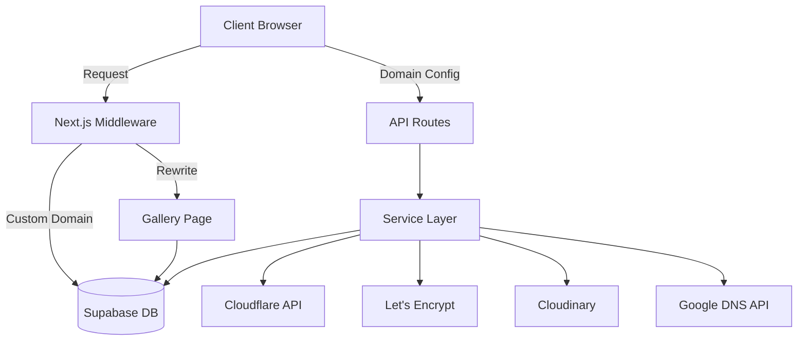
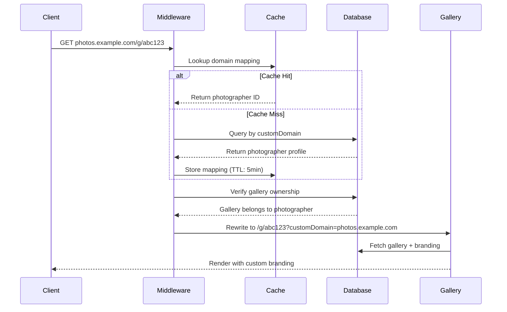
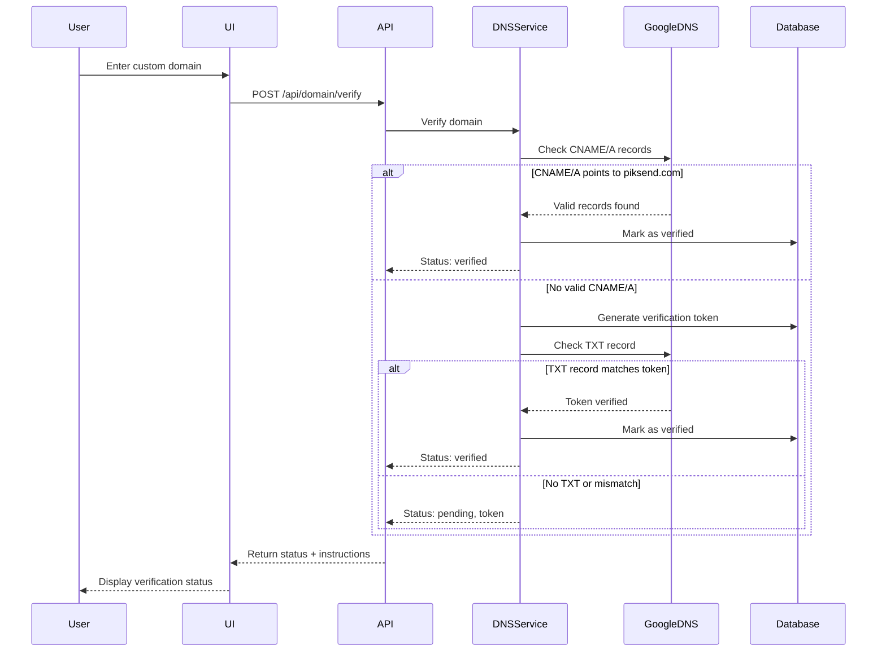
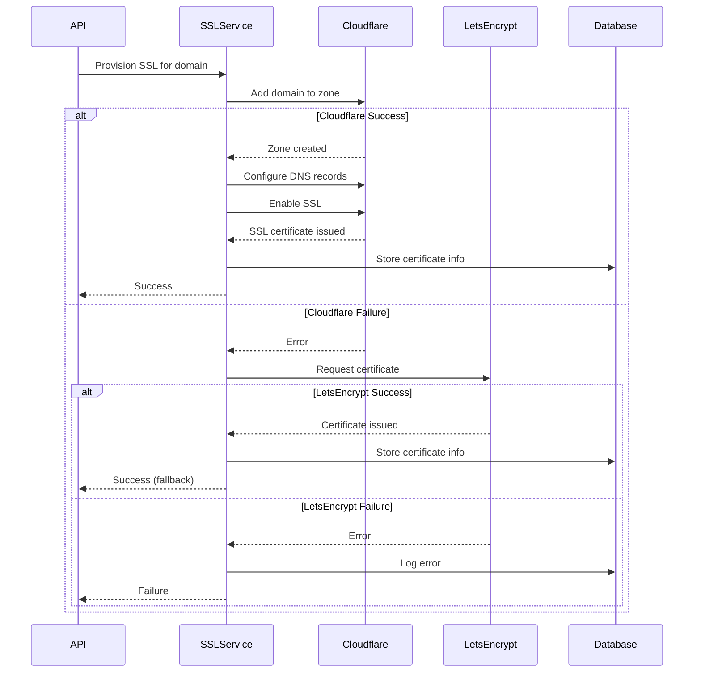

# Design Document: Custom Domain Implementation

## Overview

The custom domain implementation enables Pro plan photographers to use their own domain names (e.g., photos.example.com) for accessing their PikSend galleries. This feature provides a fully white-labeled experience by combining domain verification, automatic SSL certificate provisioning, dynamic routing, and custom branding.

The system architecture follows a layered approach:

1. **Presentation Layer**: Enhanced UI components in the settings page for domain configuration
2. **API Layer**: RESTful endpoints for domain operations (verify, provision SSL, status, remove)
3. **Service Layer**: Business logic for DNS verification, SSL provisioning, and domain management
4. **Middleware Layer**: Request interception and routing for custom domains
5. **Data Layer**: Supabase database with extended branding schema

The implementation integrates with external services:
- **Cloudflare API**: Primary provider for DNS management and SSL certificates
- **Let's Encrypt**: Fallback SSL certificate provider
- **Cloudinary**: Logo image hosting and optimization
- **Google DNS API**: DNS record verification

Key design principles:
- **Security First**: Domain ownership verification before activation
- **Performance**: Caching and async operations to minimize latency
- **Reliability**: Fallback mechanisms and comprehensive error handling
- **User Experience**: Step-by-step wizard with clear instructions and feedback

## Architecture

### System Components



### Request Flow for Custom Domain



### Domain Verification Flow



### SSL Provisioning Flow



## Components and Interfaces

### 1. Domain Verification Service

**Purpose**: Verify domain ownership through DNS records

**Interface**:
```typescript
interface IDomainVerificationService {
  /**
   * Verify domain ownership via CNAME/A or TXT records
   * @param domain - The custom domain to verify
   * @param userId - The photographer's user ID
   * @returns Verification result with status and token
   */
  verifyDomain(domain: string, userId: string): Promise<DomainVerificationResult>;
  
  /**
   * Generate unique verification token for TXT record
   * @param userId - The photographer's user ID
   * @returns Verification token string
   */
  generateVerificationToken(userId: string): string;
  
  /**
   * Check if domain points to PikSend via CNAME or A record
   * @param domain - The domain to check
   * @returns True if DNS records are correct
   */
  checkDNSRecords(domain: string): Promise<boolean>;
  
  /**
   * Verify TXT record contains the verification token
   * @param domain - The domain to check
   * @param token - The expected verification token
   * @returns True if TXT record matches
   */
  verifyTXTRecord(domain: string, token: string): Promise<boolean>;
}

interface DomainVerificationResult {
  status: 'verified' | 'pending' | 'failed';
  token?: string;
  instructions?: string;
  error?: string;
}
```

**Implementation Details**:
- Uses Google DNS-over-HTTPS API for DNS lookups
- Checks CNAME records for subdomain (photos.example.com → piksend.com)
- Checks A records for root domain (example.com → PikSend IP)
- Falls back to TXT record verification if CNAME/A not configured
- Generates cryptographically secure tokens using `crypto.randomBytes`
- Rate limits verification attempts (10 per hour per user)

### 2. SSL Provisioning Service

**Purpose**: Automatically provision and manage SSL certificates

**Interface**:
```typescript
interface ISSLProvisioningService {
  /**
   * Provision SSL certificate for verified domain
   * @param domain - The verified custom domain
   * @param userId - The photographer's user ID
   * @returns SSL provisioning result
   */
  provisionSSL(domain: string, userId: string): Promise<SSLProvisioningResult>;
  
  /**
   * Add domain to Cloudflare zone
   * @param domain - The domain to add
   * @returns Cloudflare zone ID
   */
  addToCloudflare(domain: string): Promise<string>;
  
  /**
   * Configure DNS records in Cloudflare
   * @param zoneId - Cloudflare zone ID
   * @param domain - The domain
   */
  configureDNS(zoneId: string, domain: string): Promise<void>;
  
  /**
   * Enable SSL for domain in Cloudflare
   * @param zoneId - Cloudflare zone ID
   */
  enableSSL(zoneId: string): Promise<void>;
  
  /**
   * Fallback to Let's Encrypt for SSL
   * @param domain - The domain
   * @returns Certificate information
   */
  provisionLetsEncrypt(domain: string): Promise<CertificateInfo>;
  
  /**
   * Renew SSL certificate before expiration
   * @param domain - The domain
   */
  renewCertificate(domain: string): Promise<void>;
}

interface SSLProvisioningResult {
  success: boolean;
  certificateId?: string;
  expiresAt?: Date;
  provider: 'cloudflare' | 'letsencrypt';
  error?: string;
}

interface CertificateInfo {
  id: string;
  expiresAt: Date;
  issuer: string;
}
```

**Implementation Details**:
- Primary: Cloudflare API for DNS and SSL management
- Fallback: Let's Encrypt with ACME protocol
- Stores certificate metadata in database (not private keys)
- Automatic renewal 30 days before expiration
- Webhook notifications for renewal failures

### 3. Domain Routing Middleware

**Purpose**: Intercept requests and route custom domains to correct galleries

**Interface**:
```typescript
interface ICustomDomainMiddleware {
  /**
   * Process incoming request and route based on hostname
   * @param request - Next.js request object
   * @returns Next.js response (rewrite or error)
   */
  handleRequest(request: NextRequest): Promise<NextResponse>;
  
  /**
   * Extract hostname from request headers
   * @param request - Next.js request object
   * @returns Hostname string
   */
  getHostname(request: NextRequest): string;
  
  /**
   * Lookup photographer by custom domain (with caching)
   * @param domain - Custom domain
   * @returns Photographer profile or null
   */
  lookupPhotographer(domain: string): Promise<PhotographerProfile | null>;
  
  /**
   * Verify gallery belongs to photographer
   * @param gallerySlug - Gallery unique slug
   * @param photographerId - Photographer user ID
   * @returns True if gallery belongs to photographer
   */
  verifyGalleryOwnership(gallerySlug: string, photographerId: string): Promise<boolean>;
  
  /**
   * Rewrite URL to internal route
   * @param request - Original request
   * @param slug - Gallery slug
   * @param domain - Custom domain
   * @returns Rewritten response
   */
  rewriteToGallery(request: NextRequest, slug: string, domain: string): NextResponse;
}

interface PhotographerProfile {
  id: string;
  customDomain: string;
  domainVerified: boolean;
}
```

**Implementation Details**:
- Runs on every request via Next.js middleware
- Caches domain-to-photographer mapping (5 minute TTL)
- Invalidates cache on domain configuration changes
- Adds custom domain as query parameter for branding context
- Returns 404 for unconfigured domains
- Logs latency metrics for monitoring
- Excludes API routes, static files, and Next.js internals

### 4. Domain Management API

**Purpose**: RESTful endpoints for domain operations

**Endpoints**:

#### POST /api/domain/verify
```typescript
interface VerifyDomainRequest {
  domain: string;
}

interface VerifyDomainResponse {
  status: 'verified' | 'pending' | 'failed';
  token?: string;
  instructions?: string;
  error?: string;
}
```

#### POST /api/domain/provision-ssl
```typescript
interface ProvisionSSLRequest {
  domain: string;
}

interface ProvisionSSLResponse {
  success: boolean;
  certificateId?: string;
  expiresAt?: string;
  provider: 'cloudflare' | 'letsencrypt';
  error?: string;
}
```

#### GET /api/domain/status
```typescript
interface DomainStatusResponse {
  domain: string | null;
  verified: boolean;
  sslProvisioned: boolean;
  sslExpiresAt: string | null;
  verifiedAt: string | null;
}
```

#### DELETE /api/domain/remove
```typescript
interface RemoveDomainResponse {
  success: boolean;
  message: string;
}
```

**Security**:
- All endpoints require authentication (session-based)
- CSRF token validation on mutations
- Pro plan subscription check
- Rate limiting (10 requests per minute per user)
- Input sanitization and validation
- Domain uniqueness enforcement

### 5. Enhanced Branding Section UI

**Purpose**: User interface for domain configuration

**Component Structure**:
```typescript
interface BrandingSectionProps {
  initialBranding?: ProfileBranding;
  userPlan: SubscriptionPlan;
  onUpdate: (branding: ProfileBranding) => Promise<void>;
}

interface DomainConfigurationState {
  domain: string;
  verificationStatus: 'idle' | 'verifying' | 'verified' | 'failed';
  verificationToken: string | null;
  sslStatus: 'idle' | 'provisioning' | 'provisioned' | 'failed';
  error: string | null;
}
```

**UI Components**:
1. **Domain Input Field**: Text input with real-time validation
2. **Verification Status Indicator**: Visual status (pending/verified/failed)
3. **DNS Instructions Panel**: Step-by-step setup guide with copy buttons
4. **Verification Button**: Trigger domain verification
5. **SSL Status Badge**: Shows SSL provisioning status
6. **Remove Domain Button**: Allows domain removal with confirmation

**User Flow**:
1. User enters custom domain
2. System validates format and shows instructions
3. User configures DNS records
4. User clicks "Verify Domain"
5. System checks DNS and shows status
6. If verified, system auto-provisions SSL
7. User sees success message with custom domain URL

### 6. Logo Upload Component

**Purpose**: Handle custom logo upload and display

**Interface**:
```typescript
interface ILogoUploadService {
  /**
   * Upload logo to Cloudinary
   * @param file - Image file
   * @param userId - Photographer user ID
   * @returns Cloudinary URL
   */
  uploadLogo(file: File, userId: string): Promise<string>;
  
  /**
   * Validate image file
   * @param file - Image file
   * @returns Validation result
   */
  validateImage(file: File): ValidationResult;
  
  /**
   * Delete logo from Cloudinary
   * @param url - Cloudinary URL
   */
  deleteLogo(url: string): Promise<void>;
}

interface ValidationResult {
  valid: boolean;
  error?: string;
}
```

**Implementation Details**:
- Accepts PNG, JPG, JPEG, WebP formats
- Maximum file size: 2MB
- Uploads to Cloudinary with transformations (auto format, quality optimization)
- Generates responsive image URLs
- Stores Cloudinary public ID for deletion
- Displays preview before saving

## Data Models

### Extended Profile Branding Schema

```typescript
interface ProfileBranding {
  // Existing fields
  customLogo?: string;
  brandColors?: {
    primary: string;
    secondary: string;
    accent: string;
  };
  
  // New custom domain fields
  customDomain?: string;
  domainVerified?: boolean;
  verificationToken?: string;
  domainVerifiedAt?: string; // ISO timestamp
  sslCertificateId?: string;
  sslProvider?: 'cloudflare' | 'letsencrypt';
  sslExpiresAt?: string; // ISO timestamp
  cloudflareZoneId?: string;
}
```

### Database Indexes

For performance, add indexes on:
- `profiles.branding->customDomain` (for middleware lookups)
- `profiles.branding->domainVerified` (for filtering verified domains)

### Cache Schema

```typescript
interface DomainCacheEntry {
  domain: string;
  photographerId: string;
  verified: boolean;
  cachedAt: number; // Unix timestamp
  ttl: number; // Seconds
}
```

Cache key format: `domain:${domain}`
Cache TTL: 300 seconds (5 minutes)

## Error Handling

### Error Categories

1. **Validation Errors** (400 Bad Request)
   - Invalid domain format
   - Domain already claimed
   - File size/type validation failures

2. **Authentication Errors** (401 Unauthorized)
   - Missing session
   - Invalid session token

3. **Authorization Errors** (403 Forbidden)
   - Non-Pro plan attempting custom domain
   - Attempting to verify unowned domain

4. **Not Found Errors** (404 Not Found)
   - Custom domain not configured
   - Gallery not found for photographer

5. **Rate Limit Errors** (429 Too Many Requests)
   - Exceeded verification attempts
   - Exceeded API request limit

6. **External Service Errors** (502 Bad Gateway)
   - Cloudflare API failures
   - DNS lookup failures
   - Cloudinary upload failures

7. **Internal Errors** (500 Internal Server Error)
   - Database connection failures
   - Unexpected exceptions

### Error Response Format

```typescript
interface ErrorResponse {
  error: string; // Human-readable error message
  code: string; // Machine-readable error code
  details?: Record<string, any>; // Additional context
  timestamp: string; // ISO timestamp
}
```

### Error Handling Strategy

- **Graceful Degradation**: If custom domain fails, fall back to primary domain
- **Retry Logic**: Automatic retries for transient failures (3 attempts with exponential backoff)
- **User Feedback**: Clear, actionable error messages in UI
- **Logging**: Comprehensive error logging with context (user ID, domain, stack trace)
- **Monitoring**: Alert on error rate thresholds

## Testing Strategy

### Unit Testing

**Focus Areas**:
- Domain validation logic
- DNS record parsing
- Token generation
- URL rewriting logic
- Input sanitization
- Error handling paths

**Tools**: Jest, React Testing Library

**Example Tests**:
- Test domain format validation with various inputs
- Test token generation uniqueness
- Test DNS record verification logic
- Test middleware hostname extraction
- Test error response formatting

### Property-Based Testing

**Focus Areas**:
- Domain validation across all valid/invalid formats
- URL rewriting preserves query parameters
- Cache invalidation consistency
- SSL renewal timing logic

**Tools**: fast-check (JavaScript property-based testing library)

**Configuration**:
- Minimum 100 iterations per property test
- Each test tagged with feature and property number
- Tests run in CI/CD pipeline

### Integration Testing

**Focus Areas**:
- API endpoint workflows (verify → provision SSL → status)
- Database operations (create, read, update, delete)
- External service integration (Cloudflare, Cloudinary)
- Middleware request processing

**Tools**: Jest, Supertest, MSW (Mock Service Worker)

**Example Tests**:
- Test complete domain verification flow
- Test SSL provisioning with mocked Cloudflare API
- Test middleware routing with test database
- Test logo upload with mocked Cloudinary

### End-to-End Testing

**Focus Areas**:
- Complete user journey (enter domain → verify → access gallery)
- UI interactions (form submission, status updates)
- Error scenarios (invalid domain, failed verification)

**Tools**: Playwright or Cypress

**Example Tests**:
- User enters custom domain and sees DNS instructions
- User verifies domain and sees success message
- Client accesses gallery via custom domain
- User removes custom domain

### Performance Testing

**Focus Areas**:
- Middleware latency (target: <50ms)
- Cache hit rates
- Database query performance
- API response times

**Tools**: k6, Lighthouse

**Metrics**:
- P50, P95, P99 latency for middleware
- Cache hit rate (target: >80%)
- API response time (target: <500ms)

### Security Testing

**Focus Areas**:
- Domain hijacking prevention
- CSRF protection
- Input validation
- Rate limiting effectiveness

**Tools**: OWASP ZAP, manual penetration testing

**Test Cases**:
- Attempt to claim already-verified domain
- Attempt domain operations without authentication
- Attempt SQL injection via domain input
- Exceed rate limits and verify blocking


## Correctness Properties

*A property is a characteristic or behavior that should hold true across all valid executions of a system—essentially, a formal statement about what the system should do. Properties serve as the bridge between human-readable specifications and machine-verifiable correctness guarantees.*

### Domain Validation Properties

**Property 1: Valid domain format acceptance**
*For any* string that matches the domain format pattern (alphanumeric with dots, no protocol), the domain validation function should accept it as valid.
**Validates: Requirements 1.1, 4.3**

**Property 2: Invalid domain format rejection**
*For any* string that contains invalid characters (spaces, special chars except dots/hyphens) or includes protocol prefixes, the domain validation function should reject it as invalid.
**Validates: Requirements 1.1, 4.3, 4.4**

**Property 3: Verification token uniqueness**
*For any* two token generation calls with different user IDs or timestamps, the generated tokens should be unique.
**Validates: Requirements 1.2**

**Property 4: DNS instructions presence**
*For any* generated verification token, the system should provide non-empty DNS configuration instructions.
**Validates: Requirements 1.3**

### Domain Verification Properties

**Property 5: DNS record verification correctness**
*For any* domain with CNAME or A records pointing to the primary domain, the DNS verification should return true.
**Validates: Requirements 1.4**

**Property 6: TXT record fallback verification**
*For any* domain where CNAME/A verification fails but TXT record contains the verification token, the system should mark the domain as verified.
**Validates: Requirements 1.5, 1.6**

**Property 7: Verification failure handling**
*For any* domain where both CNAME/A and TXT verification fail, the system should mark the domain status as failed.
**Validates: Requirements 1.7**

**Property 8: Domain status persistence**
*For any* domain status change (pending → verified, pending → failed), the new status should be persisted to the database.
**Validates: Requirements 1.8, 7.2**

**Property 9: Status display consistency**
*For any* domain with a stored status in the database, the UI should display that exact status.
**Validates: Requirements 1.9**

### SSL Provisioning Properties

**Property 10: Automatic SSL provisioning trigger**
*For any* domain that transitions to verified status, SSL provisioning should be automatically initiated.
**Validates: Requirements 2.1**

**Property 11: SSL provisioning fallback**
*For any* domain where Cloudflare SSL provisioning fails, the system should attempt Let's Encrypt as fallback.
**Validates: Requirements 2.6**

**Property 12: SSL certificate persistence**
*For any* successfully provisioned SSL certificate, the certificate information (ID, expiration date, provider) should be stored in the database.
**Validates: Requirements 2.5, 7.4, 7.6**

**Property 13: SSL renewal timing**
*For any* SSL certificate with expiration date within 30 days, the system should trigger automatic renewal.
**Validates: Requirements 2.7**

**Property 14: SSL provisioning notification**
*For any* SSL provisioning operation (success or failure), the system should notify the photographer.
**Validates: Requirements 2.8, 2.9**

### Middleware Routing Properties

**Property 15: Hostname extraction**
*For any* HTTP request with a Host header, the middleware should correctly extract the hostname.
**Validates: Requirements 3.1**

**Property 16: Primary domain passthrough**
*For any* request where hostname matches the primary domain (piksend.com), the middleware should allow normal routing without modification.
**Validates: Requirements 3.2**

**Property 17: Custom domain photographer lookup**
*For any* request where hostname is a custom domain, the middleware should query the database for the matching photographer.
**Validates: Requirements 3.3**

**Property 18: Unconfigured domain 404**
*For any* custom domain that has no matching photographer in the database, the middleware should return a 404 error.
**Validates: Requirements 3.4**

**Property 19: Gallery ownership verification**
*For any* gallery slug and photographer ID, the middleware should verify the gallery belongs to that photographer before routing.
**Validates: Requirements 3.6**

**Property 20: URL rewrite with query parameter preservation**
*For any* valid custom domain request with query parameters, the URL rewrite should preserve all original query parameters.
**Validates: Requirements 3.7, 3.8**

**Property 21: Root custom domain routing**
*For any* custom domain request without a gallery slug, the middleware should route to the photographer's portfolio page.
**Validates: Requirements 3.9**

**Property 22: Middleware error logging**
*For any* error encountered during middleware processing, the system should log the error with context and return an appropriate HTTP status code.
**Validates: Requirements 3.11**

### API Endpoint Properties

**Property 23: API authentication requirement**
*For any* API endpoint call (/api/domain/*), the system should verify user authentication before processing.
**Validates: Requirements 6.1**

**Property 24: Authentication failure response**
*For any* API call without valid authentication, the system should return 401 Unauthorized.
**Validates: Requirements 6.2**

**Property 25: Domain format validation in API**
*For any* authenticated API call with a domain parameter, the system should validate the domain format.
**Validates: Requirements 6.3**

**Property 26: Invalid domain API response**
*For any* API call with an invalid domain format, the system should return 400 Bad Request with error details.
**Validates: Requirements 6.4**

**Property 27: Verification response format**
*For any* successful domain verification API call, the response should include status and token fields.
**Validates: Requirements 6.6**

**Property 28: SSL provisioning precondition**
*For any* SSL provisioning API call, the system should verify the domain is already verified before proceeding.
**Validates: Requirements 6.7**

**Property 29: Unverified domain SSL rejection**
*For any* SSL provisioning request for an unverified domain, the system should return 403 Forbidden.
**Validates: Requirements 6.8**

**Property 30: Domain removal cleanup**
*For any* domain removal operation, the system should clean up SSL certificates and DNS records in addition to removing the domain configuration.
**Validates: Requirements 6.12**

### Data Storage Properties

**Property 31: Branding field storage consistency**
*For any* domain configuration data (customDomain, domainVerified, verificationToken, sslCertificateId, domainVerifiedAt, sslExpiresAt), the system should store it in the corresponding profiles.branding field.
**Validates: Requirements 7.1, 7.2, 7.3, 7.4, 7.5, 7.6**

**Property 32: Updated timestamp maintenance**
*For any* update to domain data in the profiles table, the system should update the profiles.updated_at timestamp.
**Validates: Requirements 7.7**

### Security Properties

**Property 33: Pro plan authorization**
*For any* domain operation attempt, the system should verify the user has a Pro plan subscription.
**Validates: Requirements 8.1**

**Property 34: Non-Pro plan rejection**
*For any* domain operation by a non-Pro user, the system should return 403 Forbidden.
**Validates: Requirements 8.2**

**Property 35: Domain uniqueness enforcement**
*For any* domain verification request, the system should validate the domain is not already claimed by another user.
**Validates: Requirements 8.3**

**Property 36: Claimed domain rejection**
*For any* domain already claimed by another user, verification attempts should return an error.
**Validates: Requirements 8.4**

**Property 37: Domain exclusivity after verification**
*For any* verified domain, the system should prevent other users from claiming it.
**Validates: Requirements 8.5**

**Property 38: CSRF token validation**
*For any* API endpoint mutation (POST, PUT, DELETE), the system should validate CSRF tokens.
**Validates: Requirements 8.6**

**Property 39: Input sanitization**
*For any* domain input received, the system should sanitize it to prevent injection attacks.
**Validates: Requirements 8.7**

**Property 40: Rate limiting enforcement**
*For any* user exceeding 10 verification attempts in 1 hour, the system should block further attempts.
**Validates: Requirements 1.10, 8.8**

### Caching Properties

**Property 41: Domain lookup caching**
*For any* custom domain lookup in middleware, the system should cache the domain-to-photographer mapping.
**Validates: Requirements 9.1**

**Property 42: Cache TTL configuration**
*For any* cached domain mapping, the TTL should be set to 5 minutes (300 seconds).
**Validates: Requirements 9.2**

**Property 43: Cache invalidation on configuration change**
*For any* domain configuration change (add, update, remove), the system should invalidate the relevant cache entries.
**Validates: Requirements 9.3**

**Property 44: Cache reuse across requests**
*For any* multiple gallery requests to the same custom domain within the cache TTL, the system should reuse the cached domain lookup.
**Validates: Requirements 9.8**

### Logo Upload Properties

**Property 45: Image file type validation**
*For any* uploaded file, the system should validate it is an image type (PNG, JPG, JPEG, WebP).
**Validates: Requirements 5.1**

**Property 46: Image file size validation**
*For any* uploaded image file, the system should validate the size is under 2MB.
**Validates: Requirements 5.2**

**Property 47: Cloudinary URL persistence**
*For any* successful Cloudinary upload, the system should store the Cloudinary URL in the database.
**Validates: Requirements 5.4**

**Property 48: Upload error handling**
*For any* failed logo upload, the system should display an error message to the photographer.
**Validates: Requirements 5.5**

**Property 49: Logo display with fallback**
*For any* gallery view, the system should display the custom logo if present, otherwise display the PikSend logo.
**Validates: Requirements 5.7, 5.8**

**Property 50: Logo format optimization**
*For any* displayed logo, the system should serve it in WebP format with fallback to original format.
**Validates: Requirements 5.9, 9.5**

**Property 51: Logo deletion cleanup**
*For any* logo removal operation, the system should delete the logo reference from the database.
**Validates: Requirements 5.10**

### Error Handling Properties

**Property 52: Specific error reasons**
*For any* domain verification failure, the system should provide a specific error reason (DNS not configured, TXT record missing, etc.).
**Validates: Requirements 10.1**

**Property 53: DNS record comparison in errors**
*For any* incorrect DNS record error, the system should show both expected and actual values.
**Validates: Requirements 10.2**

**Property 54: Actionable SSL error messages**
*For any* SSL provisioning failure, the system should display an actionable error message.
**Validates: Requirements 10.3**

**Property 55: Error logging with context**
*For any* API error, the system should log the error with request context (user ID, domain, timestamp).
**Validates: Requirements 10.4**

**Property 56: SSL expiration warning**
*For any* SSL certificate expiring within 30 days, the system should warn the photographer in advance.
**Validates: Requirements 10.9**

### Internationalization Properties

**Property 57: Locale-based UI rendering**
*For any* photographer with a locale preference, the system should render the UI in that locale.
**Validates: Requirements 11.1**

**Property 58: Localized DNS instructions**
*For any* DNS configuration instructions displayed, the system should translate them to the photographer's locale.
**Validates: Requirements 11.2**

**Property 59: Localized error messages**
*For any* error message displayed, the system should translate it to the photographer's locale.
**Validates: Requirements 11.3**

**Property 60: Localized success messages**
*For any* success message displayed, the system should translate it to the photographer's locale.
**Validates: Requirements 11.4**

### SEO Properties

**Property 61: Open Graph tag preservation**
*For any* gallery accessed via custom domain, the system should preserve all Open Graph meta tags.
**Validates: Requirements 12.1**

**Property 62: Canonical URL correctness**
*For any* gallery accessed via custom domain, the system should set the canonical URL to the custom domain URL.
**Validates: Requirements 12.2**

**Property 63: Noindex meta tag maintenance**
*For any* gallery accessed via custom domain, the system should maintain the noindex meta tag.
**Validates: Requirements 12.3**

**Property 64: Structured data preservation**
*For any* gallery accessed via custom domain, the system should preserve structured data (JSON-LD).
**Validates: Requirements 12.4**

**Property 65: Sitemap custom domain inclusion**
*For any* active custom domain, the system should include custom domain URLs in the sitemap.
**Validates: Requirements 12.5**

### Monitoring Properties

**Property 66: Verification attempt logging**
*For any* domain verification attempt, the system should log the attempt with timestamp and result.
**Validates: Requirements 13.1**

**Property 67: SSL provisioning status logging**
*For any* SSL provisioning operation, the system should log the status (started, succeeded, failed).
**Validates: Requirements 13.2**

**Property 68: Middleware latency tracking**
*For any* custom domain request processed by middleware, the system should track and log latency metrics.
**Validates: Requirements 13.3**

**Property 69: Error stack trace logging**
*For any* error occurrence, the system should log error details including stack traces.
**Validates: Requirements 13.4**

**Property 70: Domain access analytics**
*For any* custom domain access, the system should track usage analytics (timestamp, gallery, user agent).
**Validates: Requirements 13.5**

**Property 71: SSL expiration alerting**
*For any* SSL certificate expiring within 7 days, the system should alert system administrators.
**Validates: Requirements 13.6**

