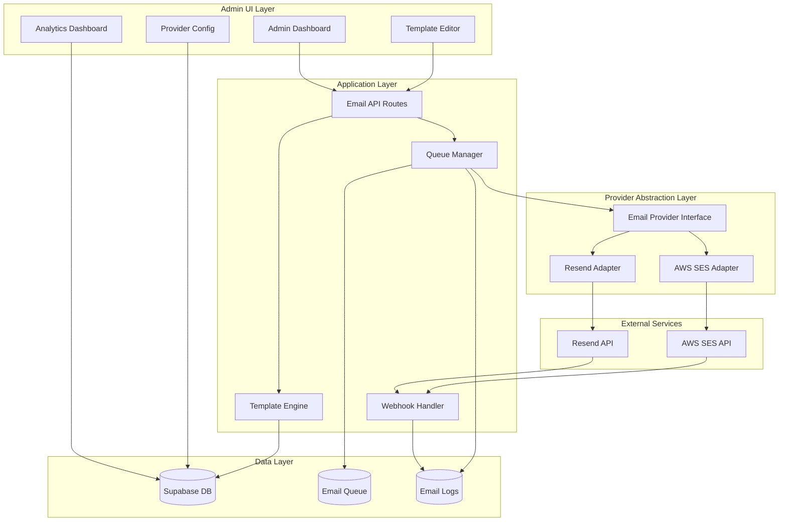

# Design Document: Email Management System

## Overview

The Email Management System is a comprehensive email infrastructure built on Next.js 16 with App Router, providing multi-provider support (Resend and AWS SES), visual template editing, email analytics, and automated delivery management. The system integrates with existing React Email templates while providing an admin interface for managing all email operations.

The architecture follows a layered approach with clear separation between the email provider abstraction layer, template management, queue processing, analytics tracking, and admin UI. The system uses Supabase for data persistence, supports both transactional and marketing emails, and includes webhook handlers for tracking delivery events.

## Architecture

### System Components



### Technology Stack

- **Frontend**: Next.js 16 App Router, React 18, TypeScript, Tailwind CSS
- **Email Templates**: React Email (@react-email/components)
- **Email Providers**: Resend SDK, AWS SDK v3 (@aws-sdk/client-sesv2)
- **Database**: Supabase (PostgreSQL)
- **Queue Processing**: Supabase Edge Functions with cron triggers
- **WYSIWYG Editor**: React Email DnD or Unlayer React Email Editor
- **Analytics**: Custom implementation with webhook tracking

### Design Principles

1. **Provider Agnostic**: Abstract email provider details behind a unified interface
2. **Backward Compatible**: Support existing React Email templates without modification
3. **Resilient**: Automatic retry with exponential backoff for failed deliveries
4. **Observable**: Comprehensive logging and analytics for all email operations
5. **Extensible**: Easy to add new email providers or template types

## Components and Interfaces

### 1. Email Provider Interface

The provider interface abstracts the differences between Resend and AWS SES:

```typescript
interface EmailProvider {
  name: 'resend' | 'aws-ses';
  
  // Send a single email
  sendEmail(params: SendEmailParams): Promise<SendEmailResult>;
  
  // Send batch emails (for marketing campaigns)
  sendBatch(emails: SendEmailParams[]): Promise<SendEmailResult[]>;
  
  // Verify sender address/domain
  verifySender(email: string): Promise<VerificationResult>;
  
  // Get verification status
  getVerificationStatus(email: string): Promise<VerificationStatus>;
  
  // Get DKIM/SPF records for domain setup
  getDomainRecords(domain: string): Promise<DomainRecords>;
}

interface SendEmailParams {
  from: string;
  to: string | string[];
  subject: string;
  html: string;
  text?: string;
  replyTo?: string;
  cc?: string[];
  bcc?: string[];
  attachments?: Attachment[];
  tags?: Record<string, string>;
  scheduledAt?: Date;
}

interface SendEmailResult {
  id: string;
  status: 'queued' | 'sent' | 'failed';
  error?: string;
}
```

### 2. Template Engine

Handles rendering of both React Email templates and custom WYSIWYG templates:

```typescript
interface TemplateEngine {
  // Render React Email template
  renderReactEmail(
    templateName: string,
    variables: Record<string, any>
  ): Promise<RenderedEmail>;
  
  // Render custom template from database
  renderCustomTemplate(
    templateId: string,
    variables: Record<string, any>
  ): Promise<RenderedEmail>;
  
  // Parse and validate template variables
  validateVariables(
    templateId: string,
    variables: Record<string, any>
  ): ValidationResult;
  
  // Generate preview with sample data
  generatePreview(
    templateId: string,
    sampleData?: Record<string, any>
  ): Promise<RenderedEmail>;
}

interface RenderedEmail {
  html: string;
  text: string;
  subject: string;
}
```

### 3. Queue Manager

Manages email queue processing with retry logic:

```typescript
interface QueueManager {
  // Add email to queue
  enqueue(email: QueuedEmail): Promise<string>;
  
  // Process next batch of emails
  processBatch(batchSize: number): Promise<ProcessResult[]>;
  
  // Retry failed email
  retry(emailId: string): Promise<void>;
  
  // Cancel scheduled email
  cancel(emailId: string): Promise<void>;
  
  // Get queue statistics
  getStats(): Promise<QueueStats>;
}

interface QueuedEmail {
  id: string;
  from: string;
  to: string;
  templateId: string;
  variables: Record<string, any>;
  scheduledAt?: Date;
  priority: 'high' | 'normal' | 'low';
  type: 'transactional' | 'marketing';
  retryCount: number;
  maxRetries: number;
}
```

### 4. Webhook Handler

Processes delivery events from email providers:

```typescript
interface WebhookHandler {
  // Handle Resend webhook
  handleResendWebhook(payload: ResendWebhookPayload): Promise<void>;
  
  // Handle AWS SES webhook (via SNS)
  handleSESWebhook(payload: SESWebhookPayload): Promise<void>;
  
  // Verify webhook signature
  verifySignature(payload: any, signature: string, provider: string): boolean;
  
  // Update email log with event
  updateEmailLog(emailId: string, event: EmailEvent): Promise<void>;
}

interface EmailEvent {
  type: 'sent' | 'delivered' | 'opened' | 'clicked' | 'bounced' | 'complained' | 'failed';
  timestamp: Date;
  metadata?: Record<string, any>;
}
```

### 5. Analytics Service

Tracks and aggregates email metrics:

```typescript
interface AnalyticsService {
  // Record email event
  recordEvent(emailId: string, event: EmailEvent): Promise<void>;
  
  // Get template analytics
  getTemplateAnalytics(
    templateId: string,
    dateRange: DateRange
  ): Promise<TemplateAnalytics>;
  
  // Get sender analytics
  getSenderAnalytics(
    senderEmail: string,
    dateRange: DateRange
  ): Promise<SenderAnalytics>;
  
  // Get overall system analytics
  getSystemAnalytics(dateRange: DateRange): Promise<SystemAnalytics>;
  
  // Export analytics data
  exportAnalytics(
    filters: AnalyticsFilters,
    format: 'csv' | 'json'
  ): Promise<string>;
}

interface TemplateAnalytics {
  sent: number;
  delivered: number;
  opened: number;
  clicked: number;
  bounced: number;
  complained: number;
  failed: number;
  openRate: number;
  clickRate: number;
  bounceRate: number;
}
```

## Data Models

### Database Schema

```sql
-- Email providers configuration
CREATE TABLE email_providers (
  id UUID PRIMARY KEY DEFAULT gen_random_uuid(),
  name VARCHAR(50) NOT NULL, -- 'resend' or 'aws-ses'
  is_active BOOLEAN DEFAULT false,
  config JSONB NOT NULL, -- API keys, region, etc.
  created_at TIMESTAMPTZ DEFAULT NOW(),
  updated_at TIMESTAMPTZ DEFAULT NOW()
);

-- Sender addresses
CREATE TABLE sender_addresses (
  id UUID PRIMARY KEY DEFAULT gen_random_uuid(),
  email VARCHAR(255) NOT NULL UNIQUE,
  name VARCHAR(255),
  is_verified BOOLEAN DEFAULT false,
  is_default BOOLEAN DEFAULT false,
  domain_records JSONB, -- DKIM, SPF records
  verified_at TIMESTAMPTZ,
  created_at TIMESTAMPTZ DEFAULT NOW(),
  updated_at TIMESTAMPTZ DEFAULT NOW()
);

-- Email templates
CREATE TABLE email_templates (
  id UUID PRIMARY KEY DEFAULT gen_random_uuid(),
  name VARCHAR(255) NOT NULL,
  slug VARCHAR(255) NOT NULL UNIQUE,
  type VARCHAR(50) NOT NULL, -- 'transactional' or 'marketing'
  source VARCHAR(50) NOT NULL, -- 'react-email' or 'custom'
  subject VARCHAR(500) NOT NULL,
  content JSONB NOT NULL, -- Template content (HTML/JSON)
  variables JSONB NOT NULL, -- Required variables
  active_version INTEGER DEFAULT 1,
  is_active BOOLEAN DEFAULT true,
  created_at TIMESTAMPTZ DEFAULT NOW(),
  updated_at TIMESTAMPTZ DEFAULT NOW()
);

-- Template versions
CREATE TABLE template_versions (
  id UUID PRIMARY KEY DEFAULT gen_random_uuid(),
  template_id UUID REFERENCES email_templates(id) ON DELETE CASCADE,
  version INTEGER NOT NULL,
  subject VARCHAR(500) NOT NULL,
  content JSONB NOT NULL,
  variables JSONB NOT NULL,
  created_by UUID, -- Admin user ID
  created_at TIMESTAMPTZ DEFAULT NOW(),
  UNIQUE(template_id, version)
);

-- Email queue
CREATE TABLE email_queue (
  id UUID PRIMARY KEY DEFAULT gen_random_uuid(),
  from_address VARCHAR(255) NOT NULL,
  to_address VARCHAR(255) NOT NULL,
  cc_addresses TEXT[],
  bcc_addresses TEXT[],
  template_id UUID REFERENCES email_templates(id),
  variables JSONB,
  subject VARCHAR(500) NOT NULL,
  html_content TEXT NOT NULL,
  text_content TEXT,
  priority VARCHAR(20) DEFAULT 'normal',
  type VARCHAR(50) NOT NULL,
  status VARCHAR(50) DEFAULT 'pending',
  scheduled_at TIMESTAMPTZ,
  retry_count INTEGER DEFAULT 0,
  max_retries INTEGER DEFAULT 3,
  last_error TEXT,
  created_at TIMESTAMPTZ DEFAULT NOW(),
  updated_at TIMESTAMPTZ DEFAULT NOW()
);

-- Email logs
CREATE TABLE email_logs (
  id UUID PRIMARY KEY DEFAULT gen_random_uuid(),
  queue_id UUID REFERENCES email_queue(id),
  provider VARCHAR(50) NOT NULL,
  provider_message_id VARCHAR(255),
  from_address VARCHAR(255) NOT NULL,
  to_address VARCHAR(255) NOT NULL,
  subject VARCHAR(500) NOT NULL,
  template_id UUID REFERENCES email_templates(id),
  status VARCHAR(50) NOT NULL,
  sent_at TIMESTAMPTZ,
  delivered_at TIMESTAMPTZ,
  opened_at TIMESTAMPTZ,
  clicked_at TIMESTAMPTZ,
  bounced_at TIMESTAMPTZ,
  complained_at TIMESTAMPTZ,
  failed_at TIMESTAMPTZ,
  error_message TEXT,
  metadata JSONB,
  created_at TIMESTAMPTZ DEFAULT NOW(),
  updated_at TIMESTAMPTZ DEFAULT NOW()
);

-- Email events (for detailed tracking)
CREATE TABLE email_events (
  id UUID PRIMARY KEY DEFAULT gen_random_uuid(),
  log_id UUID REFERENCES email_logs(id) ON DELETE CASCADE,
  event_type VARCHAR(50) NOT NULL,
  event_data JSONB,
  ip_address INET,
  user_agent TEXT,
  created_at TIMESTAMPTZ DEFAULT NOW()
);

-- Bounce/complaint tracking
CREATE TABLE email_suppressions (
  id UUID PRIMARY KEY DEFAULT gen_random_uuid(),
  email VARCHAR(255) NOT NULL UNIQUE,
  reason VARCHAR(50) NOT NULL, -- 'bounce' or 'complaint'
  bounce_type VARCHAR(50), -- 'hard' or 'soft'
  count INTEGER DEFAULT 1,
  first_occurred_at TIMESTAMPTZ DEFAULT NOW(),
  last_occurred_at TIMESTAMPTZ DEFAULT NOW(),
  created_at TIMESTAMPTZ DEFAULT NOW()
);

-- Unsubscribes (for marketing emails)
CREATE TABLE email_unsubscribes (
  id UUID PRIMARY KEY DEFAULT gen_random_uuid(),
  email VARCHAR(255) NOT NULL UNIQUE,
  reason TEXT,
  unsubscribed_at TIMESTAMPTZ DEFAULT NOW(),
  created_at TIMESTAMPTZ DEFAULT NOW()
);

-- Indexes for performance
CREATE INDEX idx_email_queue_status ON email_queue(status, scheduled_at);
CREATE INDEX idx_email_queue_created ON email_queue(created_at);
CREATE INDEX idx_email_logs_status ON email_logs(status);
CREATE INDEX idx_email_logs_template ON email_logs(template_id);
CREATE INDEX idx_email_logs_created ON email_logs(created_at);
CREATE INDEX idx_email_events_log ON email_events(log_id);
CREATE INDEX idx_email_events_type ON email_events(event_type);
```


## API Routes

### Email Management Routes

```typescript
// Send email
POST /api/emails/send
Body: {
  templateId: string;
  to: string | string[];
  variables: Record<string, any>;
  from?: string; // Optional, uses default if not provided
  scheduledAt?: string; // ISO date string
}

// Schedule email
POST /api/emails/schedule
Body: {
  templateId: string;
  to: string | string[];
  variables: Record<string, any>;
  scheduledAt: string; // ISO date string
  from?: string;
}

// Get email logs
GET /api/emails/logs
Query: {
  page?: number;
  limit?: number;
  status?: string;
  from?: string; // Date range start
  to?: string; // Date range end
  recipient?: string;
}

// Get email analytics
GET /api/emails/analytics
Query: {
  templateId?: string;
  from?: string; // Date range start
  to?: string; // Date range end
  groupBy?: 'day' | 'week' | 'month';
}

// Retry failed email
POST /api/emails/[id]/retry

// Cancel scheduled email
DELETE /api/emails/[id]/cancel
```

### Template Management Routes

```typescript
// List templates
GET /api/emails/templates
Query: {
  page?: number;
  limit?: number;
  type?: 'transactional' | 'marketing';
  source?: 'react-email' | 'custom';
}

// Get template
GET /api/emails/templates/[id]

// Create template
POST /api/emails/templates
Body: {
  name: string;
  slug: string;
  type: 'transactional' | 'marketing';
  source: 'react-email' | 'custom';
  subject: string;
  content: any; // JSON or HTML
  variables: string[];
}

// Update template
PUT /api/emails/templates/[id]
Body: {
  name?: string;
  subject?: string;
  content?: any;
  variables?: string[];
}

// Delete template (soft delete)
DELETE /api/emails/templates/[id]

// Get template versions
GET /api/emails/templates/[id]/versions

// Publish template version
POST /api/emails/templates/[id]/versions/[version]/publish

// Preview template
POST /api/emails/templates/[id]/preview
Body: {
  variables: Record<string, any>;
}
```

### Provider Configuration Routes

```typescript
// Get active provider
GET /api/emails/providers/active

// Set active provider
POST /api/emails/providers/active
Body: {
  provider: 'resend' | 'aws-ses';
}

// Update provider config
PUT /api/emails/providers/[provider]
Body: {
  config: {
    apiKey?: string; // For Resend
    accessKeyId?: string; // For AWS
    secretAccessKey?: string; // For AWS
    region?: string; // For AWS
  }
}

// Test provider connection
POST /api/emails/providers/[provider]/test
```

### Sender Address Routes

```typescript
// List sender addresses
GET /api/emails/senders

// Add sender address
POST /api/emails/senders
Body: {
  email: string;
  name?: string;
}

// Verify sender address
POST /api/emails/senders/[id]/verify

// Get verification status
GET /api/emails/senders/[id]/status

// Set default sender
POST /api/emails/senders/[id]/set-default

// Delete sender address
DELETE /api/emails/senders/[id]

// Get domain records
GET /api/emails/senders/[id]/domain-records
```

### Webhook Routes

```typescript
// Resend webhook
POST /api/webhooks/email/resend
Headers: {
  'svix-id': string;
  'svix-timestamp': string;
  'svix-signature': string;
}

// AWS SES webhook (SNS)
POST /api/webhooks/email/ses
Headers: {
  'x-amz-sns-message-type': string;
}
```

## Admin UI Components

### 1. Email Dashboard (`/admin/emails`)

Main dashboard showing email system overview.

**Components**:
- `EmailDashboard`: Main container
- `EmailStatsCards`: Quick stats (sent, delivered, opened, etc.)
- `RecentEmailsWidget`: Recent email logs
- `QueueStatusWidget`: Current queue status
- `ProviderStatusBadge`: Active provider indicator
- `QuickActionsMenu`: Send test email, view logs, etc.

### 2. Provider Configuration (`/admin/emails/providers`)

Configure email service providers.

**Components**:
- `ProviderConfigPage`: Main container
- `ProviderSelector`: Radio buttons for Resend/AWS SES
- `ResendConfigForm`: API key input and testing
- `SESConfigForm`: AWS credentials and region
- `ConnectionTestButton`: Test provider connection
- `ProviderStatusIndicator`: Connection status

### 3. Sender Management (`/admin/emails/senders`)

Manage sender email addresses.

**Components**:
- `SenderManagementPage`: Main container
- `SenderList`: Table of sender addresses
- `AddSenderForm`: Add new sender address
- `VerificationInstructions`: DKIM/SPF setup guide
- `VerificationStatusBadge`: Verification status
- `DomainRecordsModal`: Show DNS records to add

### 4. Template Management (`/admin/emails/templates`)

Manage email templates.

**Components**:
- `TemplateListPage`: Main container
- `TemplateTable`: List of templates with filters
- `TemplateCard`: Template preview card
- `TemplateFilters`: Filter by type, source, status
- `TemplateActions`: Edit, preview, delete buttons
- `CreateTemplateButton`: Navigate to editor

### 5. Template Editor (`/admin/emails/templates/new` or `/edit/[id]`)

Visual email template editor.

**Components**:
- `TemplateEditorPage`: Main container
- `TemplateEditorToolbar`: Save, preview, publish buttons
- `TemplateSettingsPanel`: Name, subject, type, variables
- `WYSIWYGEditor`: Drag-and-drop email editor
- `VariableInserter`: Insert template variables
- `PreviewModal`: Preview with sample data
- `VersionHistoryPanel`: View and manage versions

### 6. Email Logs (`/admin/emails/logs`)

View and search email logs.

**Components**:
- `EmailLogsPage`: Main container
- `EmailLogsTable`: Paginated table of logs
- `LogFilters`: Status, date range, recipient filters
- `EmailDetailModal`: Full email details
- `RetryButton`: Retry failed email
- `ExportButton`: Export logs to CSV

### 7. Analytics (`/admin/emails/analytics`)

Email performance analytics.

**Components**:
- `AnalyticsPage`: Main container
- `AnalyticsSummary`: Key metrics cards
- `EmailVolumeChart`: Time series chart
- `OpenRateChart`: Open rate over time
- `ClickRateChart`: Click rate over time
- `TemplatePerformanceTable`: Compare templates
- `SenderPerformanceTable`: Compare senders
- `DateRangePicker`: Select date range
- `ExportButton`: Export analytics data

### 8. Suppressions (`/admin/emails/suppressions`)

Manage bounces and complaints.

**Components**:
- `SuppressionsPage`: Main container
- `SuppressionList`: Table of suppressed emails
- `BounceTypeIndicator`: Hard/soft bounce badge
- `AddSuppressionForm`: Manually add suppression
- `RemoveSuppressionButton`: Remove from list
- `ComplaintsList`: View complaints

## Email Template Variables

### Standard Variables (Available in all templates)

```typescript
interface StandardVariables {
  // Application info
  appName: string; // "PikSend"
  appUrl: string; // "https://piksend.com"
  supportEmail: string; // "support@piksend.com"
  
  // Recipient info
  recipientEmail: string;
  recipientName?: string;
  
  // Sender info (for photographer branding)
  senderName?: string;
  senderEmail?: string;
  senderLogo?: string;
  
  // Unsubscribe (for marketing emails)
  unsubscribeUrl?: string;
}
```

### Template-Specific Variables

#### Purchase Confirmation
```typescript
interface PurchaseConfirmationVariables extends StandardVariables {
  buyerName?: string;
  galleryName: string;
  photoCount: number;
  amountPaid: string;
  transactionId: string;
  purchaseDate: string;
  accessLink: string;
  accessExpiresAt?: string;
  photographerName: string;
  photographerEmail?: string;
  photographerLogo?: string;
  receiptUrl?: string;
}
```

#### Sale Notification
```typescript
interface SaleNotificationVariables extends StandardVariables {
  photographerName: string;
  galleryName: string;
  photoCount: number;
  clientEmail: string;
  clientName?: string;
  grossAmount: string;
  platformFee: string;
  netEarnings: string;
  transactionId: string;
  saleDate: string;
  dashboardLink: string;
  saleDetailsLink: string;
  totalSalesCount?: number;
  totalRevenue?: string;
}
```

#### Payout Notification
```typescript
interface PayoutNotificationVariables extends StandardVariables {
  photographerName: string;
  payoutId: string;
  amount: string;
  currency: string;
  status: 'pending' | 'in_transit' | 'paid' | 'failed';
  bankName?: string;
  bankAccountLast4: string;
  createdDate: string;
  arrivalDate?: string;
  failureReason?: string;
  failureCode?: string;
  dashboardLink: string;
  payoutDetailsLink: string;
  stripeDashboardLink?: string;
  remainingBalance?: string;
}
```

#### Dispute Alert
```typescript
interface DisputeAlertVariables extends StandardVariables {
  photographerName: string;
  amount: string;
  reason: string;
  reasonDescription?: string;
  galleryName: string;
  clientEmail: string;
  purchaseDate: string;
  transactionId: string;
  responseDeadline: string;
  daysRemaining: number;
  evidenceRequired: string[];
  dashboardLink: string;
  disputeDetailsLink: string;
  stripeDashboardLink: string;
}
```

#### Refund Confirmation
```typescript
interface RefundConfirmationVariables extends StandardVariables {
  buyerName?: string;
  galleryName: string;
  refundId: string;
  refundType: 'full' | 'partial';
  refundAmount: string;
  originalAmount: string;
  refundReason?: string;
  purchaseDate: string;
  refundDate: string;
  estimatedArrival: string;
  photographerName: string;
  photographerEmail?: string;
  photographerLogo?: string;
  supportLink?: string;
}
```

## Security Considerations

### 1. API Key Storage

- Store provider API keys encrypted in database
- Use environment variables for default provider keys
- Never expose API keys in client-side code
- Rotate keys regularly

### 2. Webhook Verification

- Always verify webhook signatures
- Use timing-safe comparison for signatures
- Reject webhooks with invalid signatures
- Log all webhook attempts

### 3. Rate Limiting

- Implement rate limiting on all API routes
- Limit email sending per user/IP
- Prevent abuse of preview/test features
- Monitor for suspicious activity

### 4. Access Control

- Restrict email management to admin users only
- Implement role-based access control (RBAC)
- Log all admin actions
- Require authentication for all API routes

### 5. Data Privacy

- Encrypt sensitive email content
- Implement data retention policies
- Allow users to request data deletion
- Comply with GDPR/CCPA requirements

### 6. Email Security

- Implement SPF, DKIM, and DMARC
- Use TLS for email transmission
- Validate email addresses before sending
- Prevent email injection attacks

## Performance Optimization

### 1. Database Optimization

- Use indexes on frequently queried columns
- Implement connection pooling
- Use read replicas for analytics queries
- Archive old email logs

### 2. Caching Strategy

- Cache active provider configuration
- Cache email templates
- Cache sender addresses
- Use Redis for queue management

### 3. Queue Processing

- Process emails in batches
- Use parallel processing for batch sends
- Implement priority queues
- Monitor queue depth

### 4. Template Rendering

- Cache rendered templates
- Pre-compile React Email templates
- Optimize image sizes
- Minify HTML output

## Monitoring and Alerting

### Key Metrics to Monitor

1. **Email Volume**
   - Emails sent per hour/day
   - Queue depth
   - Processing rate

2. **Delivery Metrics**
   - Delivery rate
   - Bounce rate
   - Complaint rate
   - Open rate
   - Click rate

3. **System Health**
   - Provider API response times
   - Queue processing latency
   - Failed email count
   - Retry count

4. **Error Tracking**
   - Provider API errors
   - Template rendering errors
   - Webhook processing errors
   - Database errors

### Alerting Rules

- Alert when bounce rate > 5%
- Alert when complaint rate > 0.1%
- Alert when queue depth > 1000
- Alert when provider API fails
- Alert when failed emails > 10 in 1 hour

## Testing Strategy

### Unit Tests

- Test all service methods
- Test provider adapters
- Test template rendering
- Test queue processing logic
- Test webhook handlers

### Integration Tests

- Test end-to-end email sending
- Test provider switching
- Test webhook processing
- Test queue retry logic
- Test template versioning

### E2E Tests

- Test admin UI workflows
- Test email sending from UI
- Test template creation
- Test analytics viewing
- Test provider configuration

### Load Tests

- Test queue processing under load
- Test concurrent email sending
- Test webhook handling under load
- Test database performance

## Migration Strategy

### Phase 1: Parallel Running

1. Deploy new email system alongside existing
2. Route 10% of emails through new system
3. Monitor for errors and performance
4. Gradually increase percentage

### Phase 2: Full Migration

1. Route 100% of emails through new system
2. Keep old system as fallback
3. Monitor for 1 week
4. Decommission old system

### Phase 3: Cleanup

1. Remove old email sending code
2. Archive old email logs
3. Update documentation
4. Train team on new system

## Future Enhancements

### Phase 2 Features

1. **A/B Testing**
   - Test different subject lines
   - Test different email content
   - Automatic winner selection

2. **Email Campaigns**
   - Bulk email sending
   - Segmentation
   - Campaign analytics

3. **Advanced Analytics**
   - Heatmaps for email clicks
   - Device/client analytics
   - Geographic analytics

4. **Automation**
   - Drip campaigns
   - Triggered email sequences
   - Behavioral triggers

5. **Additional Providers**
   - SendGrid support
   - Mailgun support
   - Postmark support

6. **Advanced Editor Features**
   - Conditional content
   - Dynamic content blocks
   - Personalization rules

## Conclusion

This design provides a comprehensive email management system that:

- Supports multiple email providers (Resend and AWS SES)
- Provides a visual template editor for non-technical users
- Maintains backward compatibility with existing React Email templates
- Includes robust queue processing with automatic retries
- Tracks detailed analytics for email performance
- Provides a complete admin interface for email management
- Handles bounces, complaints, and unsubscribes automatically
- Supports both transactional and marketing emails
- Includes comprehensive monitoring and alerting

The system is designed to be scalable, maintainable, and extensible for future enhancements.
