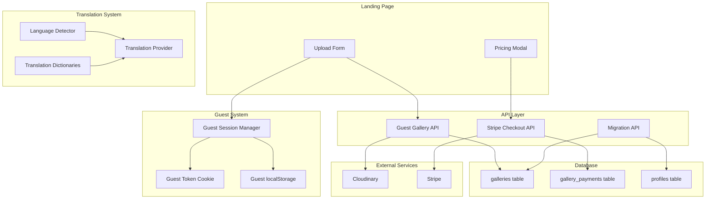

# Design Document: Guest Upload & Monetization

## Overview

Cette fonctionnalité transforme la landing page en un outil de conversion puissant en permettant aux visiteurs de créer une galerie photo sans compte. Après l'upload, un modal de pricing présente trois options de monétisation. Le système inclut également une traduction complète du site (EN/FR) et un onboarding pour les nouveaux utilisateurs.

### Key Design Decisions

1. **Guest Session via Cookie + localStorage** : Double stockage pour robustesse (cookie HTTP-only pour sécurité, localStorage pour accès client)
2. **Watermark côté client** : Overlay CSS plutôt que modification d'image pour performance et réversibilité instantanée
3. **Traduction JSON statique** : Dictionnaires chargés au build pour performance, pas de requêtes runtime
4. **Stripe Checkout hébergé** : Utilisation de Stripe Checkout plutôt que Elements pour simplifier la conformité PCI

## Architecture



## Components and Interfaces

### 1. Guest Session Manager

```typescript
// src/lib/guest/session.ts

interface GuestSession {
  token: string;
  createdAt: string;
  expiresAt: string;
}

interface IGuestSessionManager {
  getOrCreateSession(): GuestSession;
  getSession(): GuestSession | null;
  clearSession(): void;
  isValidSession(token: string): boolean;
}

// Implementation
export class GuestSessionManager implements IGuestSessionManager {
  private readonly COOKIE_NAME = 'piksend_guest_token';
  private readonly STORAGE_KEY = 'piksend_guest_session';
  private readonly SESSION_DURATION_DAYS = 7;

  getOrCreateSession(): GuestSession {
    const existing = this.getSession();
    if (existing && this.isValidSession(existing.token)) {
      return existing;
    }
    return this.createNewSession();
  }

  private createNewSession(): GuestSession {
    const token = crypto.randomUUID();
    const now = new Date();
    const expiresAt = new Date(now.getTime() + this.SESSION_DURATION_DAYS * 24 * 60 * 60 * 1000);
    
    const session: GuestSession = {
      token,
      createdAt: now.toISOString(),
      expiresAt: expiresAt.toISOString(),
    };
    
    // Store in localStorage
    localStorage.setItem(this.STORAGE_KEY, JSON.stringify(session));
    
    // Cookie is set via API response header
    return session;
  }
}
```

### 2. Upload Form Component

```typescript
// src/components/guest/guest-upload-form.tsx

interface GuestUploadFormProps {
  onUploadComplete: (gallerySlug: string) => void;
  onError: (error: string) => void;
}

interface UploadState {
  files: File[];
  uploading: boolean;
  progress: number;
  galleryTitle: string;
}

// Constraints for guest uploads
const GUEST_UPLOAD_LIMITS = {
  maxFiles: 10,
  maxFileSizeMB: 50,
  allowedTypes: ['image/jpeg', 'image/png', 'image/webp'],
};
```

### 3. Pricing Modal Component

```typescript
// src/components/guest/pricing-modal.tsx

interface PricingModalProps {
  isOpen: boolean;
  onClose: () => void;
  gallerySlug: string;
  galleryTitle: string;
  expiresAt: string;
}

interface PricingOption {
  id: 'free' | 'unlock' | 'subscribe';
  title: string;
  price: string;
  description: string;
  benefits: string[];
  recommended?: boolean;
}

const PRICING_OPTIONS: PricingOption[] = [
  {
    id: 'free',
    title: 'Keep it Free',
    price: '$0',
    description: 'Expires in 24 hours',
    benefits: ['24h access', 'PikSend watermark', 'Basic sharing'],
  },
  {
    id: 'unlock',
    title: 'Unlock This Gallery',
    price: '$2.99',
    description: 'One-time payment',
    benefits: ['30-day access', 'No watermark', 'HD downloads', 'Custom title'],
  },
  {
    id: 'subscribe',
    title: 'Go Unlimited',
    price: '$9.99/mo',
    description: 'Best value',
    benefits: ['Unlimited galleries', 'No watermarks', 'Premium features', 'Priority support'],
    recommended: true,
  },
];
```

### 4. Translation System

```typescript
// src/lib/i18n/types.ts

type SupportedLocale = 'en' | 'fr';

interface TranslationDictionary {
  [key: string]: string | TranslationDictionary;
}

interface I18nConfig {
  defaultLocale: SupportedLocale;
  supportedLocales: SupportedLocale[];
  fallbackLocale: SupportedLocale;
}

// src/lib/i18n/context.tsx
interface I18nContextValue {
  locale: SupportedLocale;
  setLocale: (locale: SupportedLocale) => void;
  t: (key: string, params?: Record<string, string>) => string;
}
```

### 5. Language Detector

```typescript
// src/lib/i18n/detector.ts

interface ILanguageDetector {
  detect(): SupportedLocale;
  getStoredPreference(): SupportedLocale | null;
  setPreference(locale: SupportedLocale): void;
}

export class LanguageDetector implements ILanguageDetector {
  private readonly STORAGE_KEY = 'piksend_locale';

  detect(): SupportedLocale {
    // 1. Check stored preference
    const stored = this.getStoredPreference();
    if (stored) return stored;

    // 2. Check navigator.language
    if (typeof navigator !== 'undefined') {
      const browserLang = navigator.language.split('-')[0];
      if (this.isSupported(browserLang)) {
        return browserLang as SupportedLocale;
      }
    }

    // 3. Default to English
    return 'en';
  }

  private isSupported(lang: string): boolean {
    return ['en', 'fr'].includes(lang);
  }
}
```

### 6. Watermark Overlay Component

```typescript
// src/components/gallery/watermark-overlay.tsx

interface WatermarkOverlayProps {
  visible: boolean;
  position?: 'bottom-right' | 'center' | 'bottom-left';
  opacity?: number;
}

// CSS-based overlay for performance
// No image modification required
```

### 7. Onboarding Guide Component

```typescript
// src/components/dashboard/onboarding-guide.tsx

interface OnboardingStep {
  id: number;
  title: string;
  description: string;
  icon: React.ComponentType;
  action?: () => void;
}

interface OnboardingGuideProps {
  onComplete: () => void;
  onDismiss: () => void;
}

const ONBOARDING_STEPS: OnboardingStep[] = [
  { id: 1, title: 'Welcome to PikSend', description: '...', icon: Sparkles },
  { id: 2, title: 'Upload your photos', description: '...', icon: Upload },
  { id: 3, title: 'Customize your gallery', description: '...', icon: Settings },
  { id: 4, title: 'Share with your clients', description: '...', icon: Share },
];
```

## Data Models

### Database Schema Extensions

```sql
-- Migration: Guest Gallery Support

-- Add guest_session_id to galleries table
ALTER TABLE public.galleries 
ADD COLUMN guest_session_id VARCHAR(255),
ADD COLUMN is_unlocked BOOLEAN DEFAULT false,
ADD COLUMN payment_type VARCHAR(20) DEFAULT 'free' 
  CHECK (payment_type IN ('free', 'one_time', 'subscription'));

-- Create index for guest session lookups
CREATE INDEX idx_galleries_guest_session ON public.galleries(guest_session_id);

-- Create gallery_payments table for one-time payments
CREATE TABLE public.gallery_payments (
  id UUID PRIMARY KEY DEFAULT gen_random_uuid(),
  gallery_id UUID NOT NULL REFERENCES public.galleries(id) ON DELETE CASCADE,
  stripe_payment_intent_id VARCHAR(255) NOT NULL UNIQUE,
  amount_cents INTEGER NOT NULL,
  currency VARCHAR(3) DEFAULT 'usd',
  status VARCHAR(20) NOT NULL CHECK (status IN ('pending', 'succeeded', 'failed', 'refunded')),
  created_at TIMESTAMP WITH TIME ZONE DEFAULT NOW(),
  updated_at TIMESTAMP WITH TIME ZONE DEFAULT NOW()
);

-- Create index for payment lookups
CREATE INDEX idx_gallery_payments_gallery ON public.gallery_payments(gallery_id);
CREATE INDEX idx_gallery_payments_intent ON public.gallery_payments(stripe_payment_intent_id);

-- RLS Policies for gallery_payments
ALTER TABLE public.gallery_payments ENABLE ROW LEVEL SECURITY;

-- Users can view payments for their galleries
CREATE POLICY "Users can view their gallery payments"
ON public.gallery_payments FOR SELECT
TO authenticated
USING (
  EXISTS (
    SELECT 1 FROM public.galleries
    WHERE galleries.id = gallery_payments.gallery_id
    AND galleries.user_id = auth.uid()
  )
);

-- Admin can view all payments
CREATE POLICY "Admin can view all payments"
ON public.gallery_payments FOR SELECT
TO authenticated
USING (
  EXISTS (
    SELECT 1 FROM public.profiles
    WHERE profiles.id = auth.uid()
    AND profiles.is_admin = true
  )
);

-- Update galleries RLS for guest access
CREATE POLICY "Guest can view their galleries"
ON public.galleries FOR SELECT
TO anon
USING (
  guest_session_id IS NOT NULL 
  AND is_active = true
);

-- Add onboarding_completed to profiles
ALTER TABLE public.profiles
ADD COLUMN onboarding_completed BOOLEAN DEFAULT false;
```

### TypeScript Types

```typescript
// src/types/guest.ts

export type PaymentType = 'free' | 'one_time' | 'subscription';

export interface GuestGallery extends Gallery {
  guest_session_id: string | null;
  is_unlocked: boolean;
  payment_type: PaymentType;
}

export interface GalleryPayment {
  id: string;
  gallery_id: string;
  stripe_payment_intent_id: string;
  amount_cents: number;
  currency: string;
  status: 'pending' | 'succeeded' | 'failed' | 'refunded';
  created_at: string;
  updated_at: string;
}

// src/types/i18n.ts

export type SupportedLocale = 'en' | 'fr';

export interface LocaleConfig {
  code: SupportedLocale;
  name: string;
  flag: string;
}

export const SUPPORTED_LOCALES: LocaleConfig[] = [
  { code: 'en', name: 'English', flag: '🇬🇧' },
  { code: 'fr', name: 'Français', flag: '🇫🇷' },
];
```

## API Endpoints

### Guest Gallery API

```typescript
// POST /api/guest/galleries
// Create a guest gallery

interface CreateGuestGalleryRequest {
  title: string;
  guestToken: string;
}

interface CreateGuestGalleryResponse {
  gallery: {
    id: string;
    slug: string;
    title: string;
    expiresAt: string;
  };
  uploadUrls: string[]; // Pre-signed Cloudinary URLs
}

// POST /api/guest/galleries/[slug]/upload
// Upload images to guest gallery

// POST /api/guest/galleries/[slug]/unlock
// Initiate payment for gallery unlock

interface UnlockGalleryRequest {
  guestToken: string;
  successUrl: string;
  cancelUrl: string;
}

interface UnlockGalleryResponse {
  checkoutUrl: string;
  sessionId: string;
}
```

### Migration API

```typescript
// POST /api/guest/migrate
// Migrate guest galleries to user account

interface MigrateGalleriesRequest {
  guestToken: string;
}

interface MigrateGalleriesResponse {
  migratedCount: number;
  galleries: Gallery[];
}
```

### Stripe Webhook Handler

```typescript
// POST /api/stripe/webhooks/guest
// Handle guest payment webhooks

// Events handled:
// - checkout.session.completed (for gallery unlock)
// - payment_intent.succeeded
// - payment_intent.payment_failed
```

## Correctness Properties

*A property is a characteristic or behavior that should hold true across all valid executions of a system-essentially, a formal statement about what the system should do. Properties serve as the bridge between human-readable specifications and machine-verifiable correctness guarantees.*


### Property 1: Guest Gallery Creation Uniqueness

*For any* guest gallery creation request with valid files and a guest session token, the system SHALL create a gallery with a unique slug that does not exist in the database, and associate it with the provided guest_session_id.

**Validates: Requirements 1.2**

### Property 2: Guest Gallery Expiration

*For any* newly created guest gallery, the expires_at timestamp SHALL be exactly 24 hours after the created_at timestamp.

**Validates: Requirements 1.3**

### Property 3: Guest Upload Validation

*For any* upload attempt to a guest gallery:
- If the number of files is 0, the upload SHALL be rejected
- If the number of files exceeds 10, the upload SHALL be rejected
- If any file size exceeds 5MB, that file SHALL be rejected
- If any file type is not in [image/jpeg, image/png, image/webp], that file SHALL be rejected

**Validates: Requirements 1.5, 1.6, 1.7**

### Property 4: Watermark Visibility Based on Unlock Status

*For any* gallery being displayed:
- If is_unlocked is false AND payment_type is 'free', the watermark overlay SHALL be visible
- If is_unlocked is true OR payment_type is not 'free', the watermark overlay SHALL NOT be visible

**Validates: Requirements 2.1, 2.3**

### Property 5: Payment Checkout Amount Correctness

*For any* payment checkout session creation:
- If payment type is 'one_time' (gallery unlock), the amount SHALL be exactly $2.99 (299 cents)
- If payment type is 'subscription', the recurring price SHALL be exactly $9.99/month (999 cents)

**Validates: Requirements 3.4, 3.5, 4.1, 5.1**

### Property 6: Unlock Benefits Application

*For any* gallery where payment has succeeded with payment_type 'one_time':
- is_unlocked SHALL be true
- expires_at SHALL be 30 days from payment date (not 24 hours)
- The gallery SHALL be accessible without watermark

**Validates: Requirements 4.2, 4.5, 4.6**

### Property 7: Gallery Migration Data Integrity

*For any* gallery migration from guest to user account:
- The gallery's user_id SHALL be set to the new user's ID
- The gallery's guest_session_id SHALL be set to NULL
- The gallery's is_unlocked status SHALL be preserved (if true before, true after)
- The gallery's payment_type SHALL be preserved
- All associated images SHALL remain linked to the gallery

**Validates: Requirements 4.4, 8.4, 8.5, 8.8**

### Property 8: Translation System Behavior

*For any* translation key lookup:
- If the key exists in the current locale dictionary, return that value
- If the key does not exist in current locale but exists in fallback (English), return fallback value
- Nested keys (e.g., "pricing.modal.title") SHALL resolve correctly by traversing the dictionary structure
- If user has manually selected a locale, that preference SHALL override auto-detection

**Validates: Requirements 6.4, 6.6, 6.7**

### Property 9: Language Switching Reactivity

*For any* language change action, all rendered translation keys in the current view SHALL immediately reflect the new locale's values without page reload.

**Validates: Requirements 7.3, 7.4**

### Property 10: Guest Session Management

*For any* guest session:
- The token SHALL be a valid UUID format
- The token SHALL be stored in both localStorage and as a cookie
- The session expiration SHALL be exactly 7 days from creation
- Two sessions created at different times SHALL have different tokens

**Validates: Requirements 8.1, 8.2, 8.3**

### Property 11: Onboarding Guide Display Logic

*For any* authenticated user accessing the dashboard:
- If onboarding_completed is false AND gallery count is 0, the onboarding guide SHALL be displayed
- If onboarding_completed is true, the onboarding guide SHALL NOT be displayed
- If gallery count > 0 (including migrated galleries), the onboarding guide SHALL NOT be displayed
- Once dismissed, onboarding_completed SHALL be set to true

**Validates: Requirements 12.1, 12.4, 12.5**

### Property 12: Gallery Type Determination

*For any* gallery record:
- If user_id is NULL AND guest_session_id is NOT NULL, the gallery type SHALL be "Guest"
- If user_id is NOT NULL AND guest_session_id is NULL, the gallery type SHALL be "User"
- If user_id is NOT NULL AND the gallery was previously a guest gallery (has payment record or conversion timestamp), the gallery type SHALL be "Converted"

**Validates: Requirements 9.4, 11.1**

## Error Handling

### Upload Errors

| Error Condition | Error Code | User Message (EN) | User Message (FR) |
|----------------|------------|-------------------|-------------------|
| File too large | FILE_TOO_LARGE | File too large. Maximum 5MB per image. | Fichier trop volumineux. Maximum 5Mo par image. |
| Invalid file type | INVALID_FILE_TYPE | Invalid file type. Please upload JPG, PNG, or WebP images. | Type de fichier invalide. Veuillez télécharger des images JPG, PNG ou WebP. |
| Too many files | TOO_MANY_FILES | Too many files. Maximum 10 images for guest galleries. | Trop de fichiers. Maximum 10 images pour les galeries invité. |
| No files | NO_FILES | Please select at least one image to upload. | Veuillez sélectionner au moins une image. |
| Network error | NETWORK_ERROR | Upload failed. Please check your connection and try again. | Échec du téléchargement. Vérifiez votre connexion et réessayez. |

### Payment Errors

| Error Condition | Error Code | Handling |
|----------------|------------|----------|
| Stripe checkout failed | CHECKOUT_FAILED | Display Stripe error message, allow retry |
| Payment declined | PAYMENT_DECLINED | Display decline reason, suggest alternative payment |
| Session expired | SESSION_EXPIRED | Redirect to gallery with option to retry payment |

### Session Errors

| Error Condition | Error Code | Handling |
|----------------|------------|----------|
| Guest session expired | GUEST_SESSION_EXPIRED | Create new session, warn user galleries may be lost |
| Guest session invalid | GUEST_SESSION_INVALID | Create new session |
| Migration failed | MIGRATION_FAILED | Log error, notify admin, allow manual retry |

## Testing Strategy

### Unit Tests

Unit tests will cover:
- Guest session token generation and validation
- Translation key resolution with nested keys
- File validation logic (size, type, count)
- Gallery type determination logic
- Expiration date calculations

### Property-Based Tests

Property-based tests will use `fast-check` library (already in devDependencies) to verify:
- Property 1: Gallery slug uniqueness
- Property 2: Expiration calculation
- Property 3: Upload validation rules
- Property 4: Watermark visibility logic
- Property 5: Payment amount correctness
- Property 6: Unlock benefits
- Property 7: Migration data integrity
- Property 8: Translation fallback behavior
- Property 10: Session token uniqueness
- Property 11: Onboarding display logic
- Property 12: Gallery type determination

Each property test will run minimum 100 iterations.

### Integration Tests

Integration tests will cover:
- Full guest upload flow (upload → pricing modal → payment → gallery view)
- Guest to user migration flow
- Language switching across pages
- Stripe webhook handling

### Test Configuration

```typescript
// vitest.config.ts additions
export default defineConfig({
  test: {
    // ... existing config
    testTimeout: 30000, // Increased for property tests
  },
});
```

Property tests will be tagged with:
```typescript
// Example: Feature: guest-upload-monetization, Property 3: Guest Upload Validation
```
