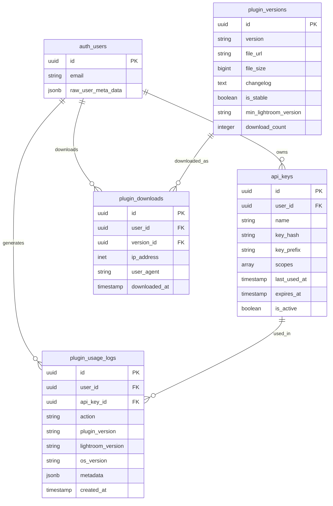

# Design Document: Lightroom Plugin Infrastructure

## Overview

This design document specifies the complete web infrastructure required to support the PikSend Lightroom plugin. The Lightroom plugin (Lua code) is fully implemented and tested, but requires backend services, API endpoints, database infrastructure, and user interfaces to function in production.

The infrastructure consists of five major components:

1. **API Key Management System**: Secure generation, storage, and validation of API keys for plugin authentication
2. **Plugin API Endpoints**: RESTful endpoints for authentication, version checking, and download management
3. **Database Layer**: Comprehensive schema with tables for API keys, plugin versions, downloads, and usage tracking
4. **User Interfaces**: Dashboard for API key management, public documentation pages, and admin tools
5. **Analytics and Monitoring**: Usage tracking, download statistics, and error monitoring

### Technology Stack

- **Framework**: Next.js 15 with App Router
- **Language**: TypeScript
- **Database**: Supabase (PostgreSQL) with Row Level Security
- **Authentication**: NextAuth.js with Supabase integration
- **File Storage**: Cloudinary for plugin file hosting
- **API**: RESTful endpoints using Next.js API routes
- **UI Components**: React with shadcn/ui component library
- **Validation**: Zod for schema validation
- **Testing**: Vitest for unit tests, fast-check for property-based tests

### Design Principles

1. **Security First**: API keys are hashed (SHA-256), never stored in plain text, and shown only once at creation
2. **Pro Plan Gating**: Only Pro plan users can generate API keys and use the plugin
3. **Performance**: API key validation must respond within 100ms at 95th percentile
4. **Scalability**: Database design supports millions of API requests with proper indexing
5. **Observability**: Comprehensive logging and usage tracking for monitoring and analytics
6. **User Experience**: Clear error messages, intuitive interfaces, and comprehensive documentation

## Architecture

### System Architecture


```mermaid
graph TB
    subgraph "Lightroom Plugin (Lua)"
        LP[Plugin Code]
    end
    
    subgraph "Next.js Application"
        subgraph "API Layer"
            AUTH[/api/plugin/auth/validate]
            VER[/api/plugin/version]
            DOWN[/api/plugin/download]
            USAGE[/api/plugin/usage]
        end
        
        subgraph "Services"
            APIKEY[APIKeyService]
            PLUGIN[PluginVersionService]
            TRACK[UsageTrackingService]
        end
        
        subgraph "UI Components"
            DASH[Dashboard - API Keys]
            DOCS[Documentation Pages]
            ADMIN[Admin Interface]
        end
    end
    
    subgraph "Database (Supabase)"
        APIKEYS[(api_keys)]
        VERSIONS[(plugin_versions)]
        DOWNLOADS[(plugin_downloads)]
        LOGS[(plugin_usage_logs)]
        USERS[(auth.users)]
    end
    
    subgraph "External Services"
        CDN[Cloudinary CDN]
    end
    
    LP -->|Bearer Token| AUTH
    LP -->|Check Updates| VER
    LP -->|Download| DOWN
    LP -->|Log Actions| USAGE
    
    AUTH --> APIKEY
    VER --> PLUGIN
    DOWN --> PLUGIN
    USAGE --> TRACK
    
    APIKEY --> APIKEYS
    APIKEY --> USERS
    PLUGIN --> VERSIONS
    PLUGIN --> DOWNLOADS
    TRACK --> LOGS
    
    DASH --> APIKEY
    ADMIN --> PLUGIN
    ADMIN --> CDN
    
    DOWN --> CDN
```

### Data Flow

#### API Key Creation Flow
1. Pro user navigates to Dashboard → Settings → API Keys
2. User clicks "Create API Key" and provides a name
3. System generates random key: `pk_live_<32_random_chars>`
4. System hashes key with SHA-256 and stores hash in database
5. System displays complete key to user (only time it's shown)
6. User copies key and configures Lightroom plugin

#### Plugin Authentication Flow
1. Plugin sends API request with `Authorization: Bearer pk_live_...` header
2. API endpoint extracts token and calls APIKeyService.validateAPIKey()
3. Service hashes provided key and queries database for matching hash
4. Service checks key is active, not expired, and user has Pro plan
5. Service updates last_used_at timestamp
6. Service returns user information or error response
7. Plugin proceeds with authenticated request or shows error

#### Plugin Update Check Flow
1. Plugin calls GET /api/plugin/version on startup
2. Endpoint queries plugin_versions table for latest stable version
3. System returns version number, download URL, changelog, and requirements
4. Plugin compares with installed version
5. If newer version available, plugin shows update notification to user

## Components and Interfaces

### APIKeyService

The APIKeyService handles all API key operations including generation, validation, and management.


**Interface:**
```typescript
interface APIKey {
  id: string;
  userId: string;
  name: string;
  keyPrefix: string;  // First 12 characters for display
  scopes: string[];
  lastUsedAt: string | null;
  expiresAt: string | null;
  createdAt: string;
  isActive: boolean;
}

interface CreateAPIKeyParams {
  name: string;
  scopes?: string[];
  expiresAt?: string;
}

interface ValidationResult {
  valid: boolean;
  user?: {
    id: string;
    name: string;
    email: string;
    planType: string;
  };
  apiKeyId?: string;
}

interface IAPIKeyService {
  createAPIKey(userId: string, params: CreateAPIKeyParams): Promise<{ key: string; apiKey: APIKey }>;
  validateAPIKey(key: string): Promise<ValidationResult>;
  listAPIKeys(userId: string): Promise<APIKey[]>;
  revokeAPIKey(userId: string, keyId: string): Promise<void>;
  deleteAPIKey(userId: string, keyId: string): Promise<void>;
}
```

**Key Generation Algorithm:**
1. Generate 24 random bytes using crypto.randomBytes()
2. Encode bytes as base64url (URL-safe base64)
3. Prefix with `pk_live_` to create final key
4. Hash complete key with SHA-256 for storage
5. Extract first 12 characters as display prefix

**Validation Algorithm:**
1. Hash provided key with SHA-256
2. Query database for matching key_hash
3. Check is_active = true
4. Check expires_at is null or in future
5. Query user's subscription plan
6. Verify plan is 'pro'
7. Update last_used_at timestamp
8. Return validation result

### PluginVersionService

The PluginVersionService manages plugin versions, downloads, and distribution.

**Interface:**
```typescript
interface PluginVersion {
  id: string;
  version: string;  // Semantic version: "1.0.0"
  fileUrl: string;  // Cloudinary URL
  fileSize: number;
  changelog: string;
  isStable: boolean;
  minLightroomVersion: string;
  releaseDate: string;
  downloadCount: number;
  createdAt: string;
}

interface CreateVersionParams {
  version: string;
  fileUrl: string;
  fileSize: number;
  changelog: string;
  isStable?: boolean;
  minLightroomVersion?: string;
}

interface IPluginVersionService {
  createVersion(params: CreateVersionParams): Promise<PluginVersion>;
  getLatestStableVersion(): Promise<PluginVersion | null>;
  getAllVersions(includeUnstable?: boolean): Promise<PluginVersion[]>;
  getVersionById(id: string): Promise<PluginVersion | null>;
  updateVersion(id: string, updates: Partial<PluginVersion>): Promise<PluginVersion>;
  recordDownload(versionId: string, userId: string | null, metadata: DownloadMetadata): Promise<void>;
  getDownloadStats(versionId: string): Promise<DownloadStats>;
}
```

**Version Comparison:**
- Use semantic versioning (major.minor.patch)
- Parse version strings and compare numerically
- Consider pre-release tags (beta, alpha) as lower than stable

### UsageTrackingService

The UsageTrackingService logs plugin actions for analytics and debugging.

**Interface:**
```typescript
interface UsageLog {
  id: string;
  userId: string;
  apiKeyId: string | null;
  action: string;  // 'auth', 'upload', 'create_gallery', etc.
  pluginVersion: string;
  lightroomVersion: string;
  osVersion: string;
  metadata: Record<string, any>;
  createdAt: string;
}

interface LogUsageParams {
  userId: string;
  apiKeyId?: string;
  action: string;
  pluginVersion?: string;
  lightroomVersion?: string;
  osVersion?: string;
  metadata?: Record<string, any>;
}

interface UsageStats {
  totalActions: number;
  uniqueUsers: number;
  actionBreakdown: Record<string, number>;
  versionDistribution: Record<string, number>;
}

interface IUsageTrackingService {
  logUsage(params: LogUsageParams): Promise<void>;
  getUserUsage(userId: string, dateRange?: DateRange): Promise<UsageLog[]>;
  getGlobalStats(dateRange?: DateRange): Promise<UsageStats>;
  getActionStats(action: string, dateRange?: DateRange): Promise<ActionStats>;
}
```

### API Endpoints

#### POST /api/plugin/auth/validate

Validates an API key and returns user information.

**Request:**
```
Headers:
  Authorization: Bearer pk_live_<token>
```

**Response (Success - 200):**
```json
{
  "valid": true,
  "user": {
    "id": "uuid",
    "name": "John Doe",
    "email": "john@example.com",
    "planType": "pro"
  }
}
```

**Response (Invalid Key - 401):**
```json
{
  "valid": false,
  "error": "Invalid or expired API key"
}
```

**Response (Non-Pro User - 403):**
```json
{
  "valid": false,
  "error": "Pro plan required",
  "user": {
    "id": "uuid",
    "name": "John Doe",
    "email": "john@example.com",
    "planType": "free"
  }
}
```

#### GET /api/plugin/version

Returns the latest stable plugin version information.

**Response (Success - 200):**
```json
{
  "version": "1.0.0",
  "downloadUrl": "https://res.cloudinary.com/.../piksend.lrplugin",
  "fileSize": 1048576,
  "changelog": "Initial release with...",
  "releaseDate": "2024-01-15T10:00:00Z",
  "minLightroomVersion": "11.0"
}
```

**Response (No Version - 404):**
```json
{
  "error": "No stable version available"
}
```

#### GET /api/plugin/download

Initiates plugin download and logs the download event.

**Query Parameters:**
- `version` (optional): Specific version to download, defaults to latest stable

**Response (Success - 302):**
- Redirects to Cloudinary URL
- Logs download in plugin_downloads table

**Response (Unauthorized - 401):**
```json
{
  "error": "Authentication required"
}
```

**Response (Non-Pro - 403):**
```json
{
  "error": "Pro plan required to download plugin"
}
```

#### POST /api/plugin/usage

Logs a plugin usage event.

**Request:**
```json
{
  "action": "upload",
  "pluginVersion": "1.0.0",
  "lightroomVersion": "13.1",
  "osVersion": "Windows 11",
  "metadata": {
    "imageCount": 5,
    "totalSize": 15728640
  }
}
```

**Response (Success - 200):**
```json
{
  "success": true
}
```

## Data Models

### Database Schema

#### api_keys Table


```sql
CREATE TABLE api_keys (
  id UUID PRIMARY KEY DEFAULT gen_random_uuid(),
  user_id UUID NOT NULL REFERENCES auth.users(id) ON DELETE CASCADE,
  name VARCHAR(100) NOT NULL,
  key_hash TEXT NOT NULL UNIQUE,
  key_prefix VARCHAR(10) NOT NULL,
  scopes TEXT[] DEFAULT ARRAY['plugin:read', 'plugin:write'],
  last_used_at TIMESTAMPTZ,
  expires_at TIMESTAMPTZ,
  created_at TIMESTAMPTZ DEFAULT NOW(),
  updated_at TIMESTAMPTZ DEFAULT NOW(),
  is_active BOOLEAN DEFAULT TRUE,
  
  CONSTRAINT valid_name CHECK (LENGTH(name) >= 1 AND LENGTH(name) <= 100),
  CONSTRAINT valid_prefix CHECK (LENGTH(key_prefix) = 12),
  CONSTRAINT valid_expiration CHECK (expires_at IS NULL OR expires_at > created_at)
);

CREATE INDEX idx_api_keys_user_id ON api_keys(user_id);
CREATE INDEX idx_api_keys_key_hash ON api_keys(key_hash);
CREATE INDEX idx_api_keys_active ON api_keys(is_active) WHERE is_active = TRUE;
CREATE INDEX idx_api_keys_expires_at ON api_keys(expires_at) WHERE expires_at IS NOT NULL;
```

**Columns:**
- `id`: Unique identifier for the API key record
- `user_id`: Foreign key to auth.users, owner of the key
- `name`: User-provided descriptive name for the key
- `key_hash`: SHA-256 hash of the complete API key (never store plain text)
- `key_prefix`: First 12 characters of key for display (e.g., "pk_live_abc1")
- `scopes`: Array of permission scopes (future extensibility)
- `last_used_at`: Timestamp of most recent successful authentication
- `expires_at`: Optional expiration date, null means no expiration
- `created_at`: Timestamp when key was created
- `updated_at`: Timestamp of last modification
- `is_active`: Boolean flag, false means key is revoked

**Row Level Security Policies:**
```sql
-- Users can only see their own API keys
CREATE POLICY "Users can view own API keys"
  ON api_keys FOR SELECT
  USING (auth.uid() = user_id);

CREATE POLICY "Users can create own API keys"
  ON api_keys FOR INSERT
  WITH CHECK (auth.uid() = user_id);

CREATE POLICY "Users can update own API keys"
  ON api_keys FOR UPDATE
  USING (auth.uid() = user_id);

CREATE POLICY "Users can delete own API keys"
  ON api_keys FOR DELETE
  USING (auth.uid() = user_id);
```

#### plugin_versions Table

```sql
CREATE TABLE plugin_versions (
  id UUID PRIMARY KEY DEFAULT gen_random_uuid(),
  version VARCHAR(20) NOT NULL UNIQUE,
  file_url TEXT NOT NULL,
  file_size BIGINT NOT NULL,
  changelog TEXT,
  is_stable BOOLEAN DEFAULT TRUE,
  min_lightroom_version VARCHAR(20) DEFAULT '11.0',
  release_date TIMESTAMPTZ DEFAULT NOW(),
  download_count INTEGER DEFAULT 0,
  created_at TIMESTAMPTZ DEFAULT NOW(),
  
  CONSTRAINT valid_version CHECK (version ~ '^\d+\.\d+\.\d+(-[a-z]+)?$'),
  CONSTRAINT valid_file_size CHECK (file_size > 0),
  CONSTRAINT valid_download_count CHECK (download_count >= 0)
);

CREATE INDEX idx_plugin_versions_version ON plugin_versions(version);
CREATE INDEX idx_plugin_versions_stable ON plugin_versions(is_stable) WHERE is_stable = TRUE;
CREATE INDEX idx_plugin_versions_release_date ON plugin_versions(release_date DESC);
```

**Columns:**
- `id`: Unique identifier for the version record
- `version`: Semantic version string (e.g., "1.0.0", "1.1.0-beta")
- `file_url`: Cloudinary URL to the .lrplugin file
- `file_size`: Size of the plugin file in bytes
- `changelog`: Markdown-formatted changelog for this version
- `is_stable`: True for production releases, false for beta/alpha
- `min_lightroom_version`: Minimum Lightroom version required
- `release_date`: When this version was released
- `download_count`: Number of times this version has been downloaded
- `created_at`: When this record was created

**Row Level Security Policies:**
```sql
-- Everyone can view stable plugin versions
CREATE POLICY "Anyone can view stable plugin versions"
  ON plugin_versions FOR SELECT
  USING (is_stable = TRUE);

-- Admin can manage all plugin versions
CREATE POLICY "Admin can manage plugin versions"
  ON plugin_versions FOR ALL
  USING (
    EXISTS (
      SELECT 1 FROM profiles
      WHERE profiles.id = auth.uid()
      AND profiles.role = 'admin'
    )
  );
```

#### plugin_downloads Table

```sql
CREATE TABLE plugin_downloads (
  id UUID PRIMARY KEY DEFAULT gen_random_uuid(),
  user_id UUID REFERENCES auth.users(id) ON DELETE SET NULL,
  version_id UUID NOT NULL REFERENCES plugin_versions(id),
  ip_address INET,
  user_agent TEXT,
  downloaded_at TIMESTAMPTZ DEFAULT NOW(),
  
  CONSTRAINT valid_user_agent CHECK (LENGTH(user_agent) <= 500)
);

CREATE INDEX idx_plugin_downloads_user_id ON plugin_downloads(user_id);
CREATE INDEX idx_plugin_downloads_version_id ON plugin_downloads(version_id);
CREATE INDEX idx_plugin_downloads_downloaded_at ON plugin_downloads(downloaded_at DESC);
```

**Columns:**
- `id`: Unique identifier for the download record
- `user_id`: Foreign key to auth.users, null if unauthenticated
- `version_id`: Foreign key to plugin_versions
- `ip_address`: IP address of the downloader
- `user_agent`: Browser/client user agent string
- `downloaded_at`: Timestamp of the download

**Row Level Security Policies:**
```sql
-- Users can view their own downloads
CREATE POLICY "Users can view own downloads"
  ON plugin_downloads FOR SELECT
  USING (auth.uid() = user_id);

-- Admin can view all downloads
CREATE POLICY "Admin can view all downloads"
  ON plugin_downloads FOR SELECT
  USING (
    EXISTS (
      SELECT 1 FROM profiles
      WHERE profiles.id = auth.uid()
      AND profiles.role = 'admin'
    )
  );
```

#### plugin_usage_logs Table

```sql
CREATE TABLE plugin_usage_logs (
  id UUID PRIMARY KEY DEFAULT gen_random_uuid(),
  user_id UUID NOT NULL REFERENCES auth.users(id) ON DELETE CASCADE,
  api_key_id UUID REFERENCES api_keys(id) ON DELETE SET NULL,
  action VARCHAR(50) NOT NULL,
  plugin_version VARCHAR(20),
  lightroom_version VARCHAR(20),
  os_version VARCHAR(50),
  metadata JSONB,
  created_at TIMESTAMPTZ DEFAULT NOW(),
  
  CONSTRAINT valid_action CHECK (LENGTH(action) >= 1 AND LENGTH(action) <= 50)
);

CREATE INDEX idx_plugin_usage_logs_user_id ON plugin_usage_logs(user_id);
CREATE INDEX idx_plugin_usage_logs_action ON plugin_usage_logs(action);
CREATE INDEX idx_plugin_usage_logs_created_at ON plugin_usage_logs(created_at DESC);
CREATE INDEX idx_plugin_usage_logs_metadata ON plugin_usage_logs USING GIN (metadata);
```

**Columns:**
- `id`: Unique identifier for the log entry
- `user_id`: Foreign key to auth.users
- `api_key_id`: Foreign key to api_keys, null if key was deleted
- `action`: Type of action performed (e.g., 'auth', 'upload', 'create_gallery')
- `plugin_version`: Version of the plugin that performed the action
- `lightroom_version`: Version of Lightroom being used
- `os_version`: Operating system version
- `metadata`: Additional JSON data specific to the action
- `created_at`: Timestamp when the action occurred

**Row Level Security Policies:**
```sql
-- Users can view their own usage logs
CREATE POLICY "Users can view own usage logs"
  ON plugin_usage_logs FOR SELECT
  USING (auth.uid() = user_id);

-- Admin can view all usage logs
CREATE POLICY "Admin can view all usage logs"
  ON plugin_usage_logs FOR SELECT
  USING (
    EXISTS (
      SELECT 1 FROM profiles
      WHERE profiles.id = auth.uid()
      AND profiles.role = 'admin'
    )
  );
```

### Data Relationships



## Correctness Properties


### Property 1: API Key Uniqueness and Security

**Validates: Requirements 1.1, 1.2, 1.3, 12.1, 12.2**

For all API keys generated by the system:
- Each generated key MUST be unique across all users and time
- The key format MUST match `pk_live_[A-Za-z0-9_-]{32}`
- The stored key_hash MUST be a valid SHA-256 hash (64 hexadecimal characters)
- The key_prefix MUST be exactly the first 12 characters of the original key
- No two keys SHALL produce the same hash (collision resistance)

**Test Strategy:**
- Generate 10,000 API keys and verify all are unique
- Verify key format matches regex pattern
- Verify hash length is exactly 64 characters
- Verify prefix extraction is correct
- Test that same key always produces same hash

### Property 2: API Key Validation Correctness

**Validates: Requirements 2.1, 2.2, 2.3, 2.6, 2.7**

For all API key validation attempts:
- A valid, active, non-expired key for a Pro user MUST return valid=true
- An invalid key MUST return valid=false with 401 status
- An expired key MUST return valid=false with 401 status
- A revoked key (is_active=false) MUST return valid=false with 401 status
- A valid key for a non-Pro user MUST return valid=false with 403 status
- Validation MUST use constant-time comparison to prevent timing attacks

**Test Strategy:**
- Property test with various key states (valid, invalid, expired, revoked)
- Property test with various user plan types (free, pro, enterprise)
- Measure timing variance to ensure constant-time comparison
- Test edge cases: keys that differ by one character

### Property 3: Row Level Security Enforcement

**Validates: Requirements 3.6, 3.7, 3.8, 3.9**

For all database queries on plugin tables:
- Users can ONLY see their own API keys
- Users can ONLY see their own downloads
- Users can ONLY see their own usage logs
- Non-admin users can ONLY see stable plugin versions
- Admin users can see ALL records in all tables
- Attempting to access another user's data MUST return empty results or error

**Test Strategy:**
- Create multiple users with different roles
- Attempt cross-user data access and verify it fails
- Verify admin can access all data
- Verify non-admin cannot access unstable versions

### Property 4: Semantic Version Ordering

**Validates: Requirements 4.7, 6.1**

For all plugin versions:
- Version strings MUST follow semantic versioning (major.minor.patch)
- When comparing versions, 2.0.0 > 1.9.9
- When comparing versions, 1.1.0 > 1.0.9
- When comparing versions, 1.0.1 > 1.0.0
- Pre-release versions (1.0.0-beta) < stable versions (1.0.0)
- The latest stable version MUST be the highest version number where is_stable=true

**Test Strategy:**
- Property test version comparison with random semantic versions
- Test edge cases: pre-release tags, major version bumps
- Verify getLatestStableVersion returns correct version

### Property 5: Download Tracking Integrity

**Validates: Requirements 5.3, 5.8, 5.10**

For all plugin downloads:
- Every download MUST create exactly one record in plugin_downloads
- The download_count on plugin_versions MUST increment by exactly 1
- The download record MUST include user_id (if authenticated), version_id, IP, and user agent
- Concurrent downloads MUST not cause race conditions in download_count
- Download records MUST be immutable after creation

**Test Strategy:**
- Simulate concurrent downloads and verify count accuracy
- Verify download record creation
- Test authenticated and unauthenticated downloads
- Property test: sum of download records = download_count for each version

### Property 6: Usage Log Completeness

**Validates: Requirements 11.1, 11.2, 11.3, 11.4**

For all plugin actions:
- Every logged action MUST include user_id, action type, and timestamp
- Optional fields (plugin_version, lightroom_version, os_version) MAY be null
- Metadata MUST be valid JSON
- Logs MUST be append-only (no updates or deletes except cascade)
- Logs MUST be queryable by user_id, action, and date range

**Test Strategy:**
- Log various actions and verify all required fields are present
- Test with and without optional fields
- Verify metadata JSON validity
- Test querying with various filters

### Property 7: Performance Requirements

**Validates: Requirements 14.1, 14.2, 14.3, 14.5**

For all API operations:
- API key validation MUST respond within 100ms at 95th percentile
- Plugin version queries MUST be cached for at least 5 minutes
- The system MUST handle 100 concurrent API key validations without degradation
- Database queries MUST use appropriate indexes

**Test Strategy:**
- Load test with 100 concurrent validation requests
- Measure response times and verify 95th percentile < 100ms
- Verify cache hit rates for version queries
- Analyze query plans to ensure index usage

### Property 8: Rate Limiting and Security

**Validates: Requirements 12.3, 12.4, 12.5**

For all API endpoints:
- Requests exceeding rate limits MUST return 429 status
- Rate limits MUST be enforced per API key
- Failed authentication attempts MUST be logged
- Repeated failures MUST trigger exponential backoff
- All API communications MUST use HTTPS

**Test Strategy:**
- Send requests exceeding rate limits and verify 429 response
- Verify rate limits are per-key, not global
- Test exponential backoff behavior
- Verify failed attempts are logged

## User Interface Components

### Dashboard: API Keys Management Page

**Location:** `/settings/api-keys`

**Components:**

1. **APIKeyList Component**
   - Displays table of user's API keys
   - Columns: Name, Prefix, Created, Last Used, Expires, Status, Actions
   - Shows "Never used" badge for keys with null last_used_at
   - Shows "Expired" badge for keys past expires_at
   - Shows "Expiring soon" warning for keys expiring within 7 days

2. **CreateAPIKeyDialog Component**
   - Modal dialog with form fields:
     - Name (required, max 100 characters)
     - Expiration date (optional, date picker)
   - On submit: calls API to create key
   - On success: shows APIKeyCreatedDialog with full key

3. **APIKeyCreatedDialog Component**
   - Displays complete API key in monospace font
   - Copy button with visual feedback
   - Warning message: "This key will only be shown once"
   - Cannot be dismissed until user acknowledges

4. **APIKeyCard Component**
   - Card displaying single API key
   - Shows: name, prefix (e.g., "pk_live_abc1..."), dates, status
   - Actions: Revoke, Delete (with confirmation dialogs)
   - Color-coded status indicators

5. **ProPlanGate Component**
   - Wraps entire page
   - If user is not Pro: shows upgrade prompt instead of content
   - Links to pricing page

**State Management:**
- Use React Query for API key list fetching and mutations
- Optimistic updates for revoke/delete actions
- Cache invalidation on create/revoke/delete

**Accessibility:**
- All interactive elements keyboard accessible
- Screen reader announcements for actions
- ARIA labels for status indicators
- Focus management in dialogs

### Public: Documentation Page

**Location:** `/docs/lightroom`

**Sections:**

1. **Overview**
   - Brief introduction to the plugin
   - Key features and benefits
   - System requirements

2. **Installation**
   - Step-by-step instructions for Windows
   - Step-by-step instructions for macOS
   - Screenshots for each step
   - Troubleshooting common installation issues

3. **Configuration**
   - How to generate an API key
   - How to enter API key in Lightroom
   - How to verify connection

4. **Usage**
   - Creating galleries from Lightroom
   - Uploading images
   - Managing gallery settings
   - Using presets

5. **Troubleshooting**
   - Common errors and solutions
   - How to check logs
   - How to contact support

6. **Changelog**
   - Version history
   - Links to download specific versions

**Features:**
- Table of contents with anchor links
- Search functionality
- Responsive design for mobile
- SEO optimized with meta tags
- Breadcrumb navigation

### Public: Plugin Download Page

**Location:** `/download/lightroom`

**Components:**

1. **VersionInfo Component**
   - Displays latest stable version number
   - File size
   - Release date
   - Changelog (expandable)

2. **SystemRequirements Component**
   - Minimum Lightroom version
   - Supported operating systems
   - Disk space required

3. **DownloadButton Component**
   - Large, prominent download button
   - If not authenticated: redirects to login
   - If not Pro: shows upgrade prompt
   - If Pro: initiates download and logs event

4. **InstallationInstructions Component**
   - Quick start guide
   - Link to full documentation

**Authentication Flow:**
- Unauthenticated users can view page but not download
- Non-Pro users see upgrade CTA
- Pro users can download immediately

### Admin: Plugin Management Interface

**Location:** `/admin/plugin`

**Tabs:**

1. **Versions Tab**
   - Table of all plugin versions (stable and unstable)
   - Columns: Version, Status, Release Date, Downloads, Actions
   - Actions: Edit, Mark Stable/Unstable, Delete
   - Upload new version button

2. **Upload Tab**
   - Drag-and-drop file upload
   - File validation (.lrplugin extension)
   - Upload to Cloudinary with progress bar
   - Form fields:
     - Version number (semantic versioning validation)
     - Changelog (markdown editor)
     - Minimum Lightroom version
     - Stability status (stable/beta/alpha)
   - Submit button creates new version record

3. **Statistics Tab**
   - Total downloads chart (line chart over time)
   - Downloads by version (pie chart)
   - Active users (last 30 days)
   - Most common actions (bar chart)
   - Version distribution (bar chart)
   - Lightroom version distribution (bar chart)

4. **Usage Logs Tab**
   - Filterable table of usage logs
   - Filters: Date range, User, Action type
   - Columns: Timestamp, User, Action, Plugin Version, LR Version, OS
   - Expandable rows show metadata JSON
   - Export to CSV button

**Permissions:**
- Only accessible to admin users
- Non-admin users get 403 error

## API Routes Implementation

### Route: POST /api/settings/api-keys

Creates a new API key for the authenticated user.

**Authentication:** Required (session-based)

**Authorization:** User must have Pro plan

**Request Body:**
```typescript
{
  name: string;        // 1-100 characters
  expiresAt?: string;  // ISO 8601 date, optional
}
```

**Response (201):**
```typescript
{
  key: string;         // Full API key, shown only once
  apiKey: {
    id: string;
    name: string;
    keyPrefix: string;
    createdAt: string;
    expiresAt: string | null;
    isActive: boolean;
  }
}
```

**Errors:**
- 401: Not authenticated
- 403: Not a Pro user
- 400: Invalid request body
- 500: Server error

**Implementation:**
```typescript
export async function POST(request: NextRequest) {
  const session = await getServerSession();
  if (!session) return unauthorized();
  
  const user = await getUserWithPlan(session.user.id);
  if (user.planType !== 'pro') return forbidden('Pro plan required');
  
  const body = await request.json();
  const validated = createAPIKeySchema.parse(body);
  
  const supabase = await createServerClient();
  const apiKeyService = new APIKeyService(supabase);
  
  const result = await apiKeyService.createAPIKey(session.user.id, validated);
  
  return NextResponse.json(result, { status: 201 });
}
```

### Route: GET /api/settings/api-keys

Lists all API keys for the authenticated user.

**Authentication:** Required

**Response (200):**
```typescript
{
  apiKeys: Array<{
    id: string;
    name: string;
    keyPrefix: string;
    lastUsedAt: string | null;
    expiresAt: string | null;
    createdAt: string;
    isActive: boolean;
  }>
}
```

### Route: DELETE /api/settings/api-keys/[id]

Deletes an API key.

**Authentication:** Required

**Authorization:** User must own the key

**Response (204):** No content

**Errors:**
- 401: Not authenticated
- 404: Key not found or not owned by user

### Route: PATCH /api/settings/api-keys/[id]/revoke

Revokes an API key (sets is_active=false).

**Authentication:** Required

**Authorization:** User must own the key

**Response (200):**
```typescript
{
  success: true
}
```

### Route: GET /api/admin/plugin/versions

Lists all plugin versions (admin only).

**Authentication:** Required

**Authorization:** Admin role required

**Query Parameters:**
- `includeUnstable`: boolean (default: true)

**Response (200):**
```typescript
{
  versions: Array<PluginVersion>
}
```

### Route: POST /api/admin/plugin/versions

Creates a new plugin version (admin only).

**Authentication:** Required

**Authorization:** Admin role required

**Request Body:**
```typescript
{
  version: string;              // Semantic version
  fileUrl: string;              // Cloudinary URL
  fileSize: number;             // Bytes
  changelog: string;            // Markdown
  isStable?: boolean;           // Default: false
  minLightroomVersion?: string; // Default: "11.0"
}
```

**Response (201):**
```typescript
{
  version: PluginVersion
}
```

### Route: POST /api/admin/plugin/upload

Uploads a plugin file to Cloudinary (admin only).

**Authentication:** Required

**Authorization:** Admin role required

**Request:** multipart/form-data with file

**Response (200):**
```typescript
{
  url: string;      // Cloudinary URL
  fileSize: number; // Bytes
}
```

**Implementation:**
- Validate file extension is .lrplugin
- Upload to Cloudinary with appropriate folder structure
- Return URL and file size for version creation

### Route: GET /api/admin/plugin/stats

Returns usage statistics (admin only).

**Authentication:** Required

**Authorization:** Admin role required

**Query Parameters:**
- `startDate`: ISO 8601 date
- `endDate`: ISO 8601 date

**Response (200):**
```typescript
{
  totalDownloads: number;
  activeUsers: number;
  actionBreakdown: Record<string, number>;
  versionDistribution: Record<string, number>;
  lightroomVersions: Record<string, number>;
}
```

## Testing Strategy

### Unit Tests

**APIKeyService Tests:**
- Test key generation format and uniqueness
- Test hash generation and validation
- Test key prefix extraction
- Test validation logic for all states
- Test Pro plan requirement
- Test expiration checking
- Test last_used_at update

**PluginVersionService Tests:**
- Test semantic version parsing and comparison
- Test getLatestStableVersion logic
- Test download recording
- Test download count increment
- Test version filtering (stable vs unstable)

**UsageTrackingService Tests:**
- Test log creation with all fields
- Test log creation with minimal fields
- Test metadata JSON handling
- Test querying with filters

### Integration Tests

**API Endpoint Tests:**
- Test complete API key lifecycle (create, list, revoke, delete)
- Test authentication and authorization
- Test Pro plan gating
- Test plugin version endpoints
- Test download flow
- Test usage logging

**Database Tests:**
- Test RLS policies with different user roles
- Test cascade deletes
- Test constraints and validations
- Test index usage in queries

### Property-Based Tests

**Property 1: API Key Uniqueness**
```typescript
fc.assert(
  fc.property(fc.array(fc.string(), { minLength: 100 }), async (userIds) => {
    const keys = await Promise.all(
      userIds.map(id => apiKeyService.createAPIKey(id, { name: 'test' }))
    );
    const uniqueKeys = new Set(keys.map(k => k.key));
    return uniqueKeys.size === keys.length;
  })
);
```

**Property 2: Hash Consistency**
```typescript
fc.assert(
  fc.property(fc.string({ minLength: 32 }), (key) => {
    const hash1 = createHash('sha256').update(key).digest('hex');
    const hash2 = createHash('sha256').update(key).digest('hex');
    return hash1 === hash2;
  })
);
```

**Property 3: Version Ordering**
```typescript
fc.assert(
  fc.property(
    fc.tuple(fc.semver(), fc.semver()),
    ([v1, v2]) => {
      const cmp = compareVersions(v1, v2);
      const reverseCmp = compareVersions(v2, v1);
      return cmp === -reverseCmp;
    }
  )
);
```

### End-to-End Tests

**User Flow: Create and Use API Key**
1. Login as Pro user
2. Navigate to API keys page
3. Create new API key
4. Copy key from dialog
5. Use key to authenticate plugin request
6. Verify authentication succeeds
7. Verify last_used_at is updated

**User Flow: Download Plugin**
1. Login as Pro user
2. Navigate to download page
3. Click download button
4. Verify redirect to Cloudinary
5. Verify download record created
6. Verify download count incremented

**Admin Flow: Upload New Version**
1. Login as admin
2. Navigate to plugin management
3. Upload .lrplugin file
4. Fill version form
5. Submit
6. Verify version appears in list
7. Verify file accessible via URL

## Security Considerations

### API Key Security

1. **Storage:**
   - Never store plain text keys
   - Use SHA-256 for hashing
   - Store only hash and prefix

2. **Transmission:**
   - Always use HTTPS
   - Keys sent in Authorization header
   - Never log full keys

3. **Validation:**
   - Use constant-time comparison
   - Check active status
   - Check expiration
   - Verify Pro plan

4. **Revocation:**
   - Immediate effect (no caching)
   - Logged for audit trail
   - Cannot be undone

### Rate Limiting

**Implementation:**
- Use Redis or in-memory cache for rate limit tracking
- Key: API key hash
- Limit: 100 requests per minute per key
- Burst: 10 requests per second
- Response: 429 with Retry-After header

**Endpoints to Rate Limit:**
- /api/plugin/auth/validate (most critical)
- /api/plugin/usage
- /api/plugin/download

### Input Validation

**All user inputs must be validated:**
- API key names: 1-100 characters, no special characters
- Version numbers: semantic versioning regex
- Dates: valid ISO 8601 format
- File uploads: .lrplugin extension, max 50MB
- Metadata: valid JSON, max 10KB

**Use Zod schemas for validation:**
```typescript
const createAPIKeySchema = z.object({
  name: z.string().min(1).max(100),
  expiresAt: z.string().datetime().optional(),
});

const createVersionSchema = z.object({
  version: z.string().regex(/^\d+\.\d+\.\d+(-[a-z]+)?$/),
  fileUrl: z.string().url(),
  fileSize: z.number().positive(),
  changelog: z.string(),
  isStable: z.boolean().default(false),
  minLightroomVersion: z.string().regex(/^\d+\.\d+$/),
});
```

### CORS Configuration

**Allowed Origins:**
- Production domain: https://piksend.com
- Development: http://localhost:3000
- Lightroom plugin: Allow all (plugin makes requests from desktop)

**Allowed Methods:**
- GET, POST, PATCH, DELETE

**Allowed Headers:**
- Authorization, Content-Type

**Credentials:**
- Include credentials for authenticated endpoints

## Deployment Considerations

### Database Migration

**Migration Order:**
1. Create api_keys table
2. Create plugin_versions table
3. Create plugin_downloads table
4. Create plugin_usage_logs table
5. Create indexes
6. Enable RLS
7. Create RLS policies

**Rollback Plan:**
- Each migration should have a down migration
- Test rollback in staging environment
- Keep migrations idempotent

### Environment Variables

**Required:**
- `CLOUDINARY_CLOUD_NAME`: Cloudinary account name
- `CLOUDINARY_API_KEY`: Cloudinary API key
- `CLOUDINARY_API_SECRET`: Cloudinary API secret
- `NEXT_PUBLIC_SUPABASE_URL`: Supabase project URL
- `SUPABASE_SERVICE_ROLE_KEY`: Supabase service role key

**Optional:**
- `RATE_LIMIT_REQUESTS_PER_MINUTE`: Default 100
- `RATE_LIMIT_BURST`: Default 10
- `VERSION_CACHE_TTL_SECONDS`: Default 300 (5 minutes)

### Monitoring and Alerts

**Metrics to Track:**
- API key validation response time (p50, p95, p99)
- API key validation success rate
- Plugin download count
- Active users (daily, weekly, monthly)
- Error rates by endpoint
- Database query performance

**Alerts:**
- API validation p95 > 100ms
- Error rate > 1%
- Download failures > 5%
- Database connection pool exhaustion
- Cloudinary upload failures

**Logging:**
- All API requests (endpoint, user_id, status, duration)
- All authentication failures
- All admin actions
- All errors with stack traces

### Performance Optimization

**Caching Strategy:**
- Plugin version info: 5 minutes (CDN + application)
- API key validation: No caching (security)
- Usage statistics: 1 hour (admin dashboard)

**Database Optimization:**
- Connection pooling (max 20 connections)
- Read replicas for analytics queries
- Indexes on all foreign keys and frequently queried columns
- Periodic VACUUM and ANALYZE

**CDN Configuration:**
- Cache plugin files for 1 year
- Use versioned URLs for cache busting
- Enable gzip compression
- Set appropriate cache headers

## Future Enhancements

### Phase 2 Features

1. **API Key Scopes:**
   - Granular permissions (read-only, upload-only, etc.)
   - Scope validation in endpoints
   - UI for selecting scopes

2. **Webhook Support:**
   - Notify external services of plugin events
   - Webhook signature verification
   - Retry logic for failed webhooks

3. **Advanced Analytics:**
   - User cohort analysis
   - Retention metrics
   - A/B testing for plugin features

4. **Multi-language Support:**
   - Translate documentation
   - Translate UI
   - Support for RTL languages

5. **Plugin Marketplace:**
   - Third-party plugin extensions
   - Plugin ratings and reviews
   - Featured plugins section

### Technical Debt

1. **Caching Layer:**
   - Implement Redis for distributed caching
   - Cache API key validations (with short TTL)
   - Cache usage statistics

2. **Async Processing:**
   - Queue system for usage log processing
   - Background jobs for statistics aggregation
   - Scheduled cleanup of old logs

3. **Testing Coverage:**
   - Increase unit test coverage to 90%
   - Add more property-based tests
   - Implement visual regression testing for UI

4. **Documentation:**
   - API documentation with OpenAPI/Swagger
   - Architecture decision records (ADRs)
   - Runbook for common operations

## Conclusion

This design document provides a comprehensive blueprint for implementing the web infrastructure to support the PikSend Lightroom plugin. The design prioritizes security, performance, and user experience while maintaining scalability and maintainability.

Key design decisions:
- SHA-256 hashing for API keys with one-time display
- Pro plan gating for all plugin functionality
- Comprehensive RLS policies for data security
- RESTful API design for plugin communication
- Property-based testing for correctness guarantees
- Cloudinary CDN for plugin file distribution

The implementation should follow the phased approach outlined in the requirements document, starting with the critical database and API infrastructure, then building out the user interfaces and admin tools.
