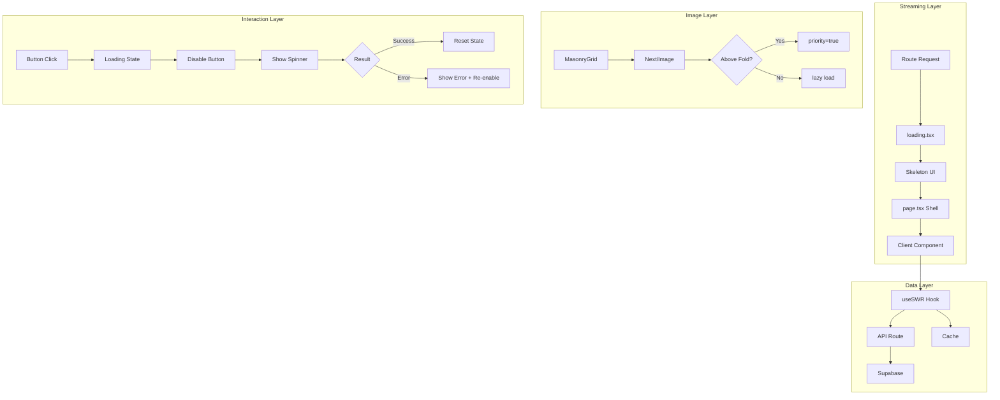

# Design Document: Performance Optimization

## Overview

Cette fonctionnalité améliore les Core Web Vitals (LCP, TTFB, INP) de l'application en implémentant :
1. Le streaming Next.js avec des skeletons pour un FCP instantané
2. Le data fetching client-side non-bloquant avec SWR
3. L'optimisation des images avec Next/Image et priority
4. Le feedback visuel immédiat sur les interactions

## Architecture



## Components and Interfaces

### 1. Loading Components (Streaming)

```typescript
// src/app/(dashboard)/dashboard/loading.tsx
export default function DashboardLoading() {
  return <DashboardSkeleton />;
}

// src/app/g/[slug]/loading.tsx
export default function GalleryLoading() {
  return <GallerySkeleton />;
}
```

### 2. Skeleton Components

```typescript
// src/components/skeletons/dashboard-skeleton.tsx
interface DashboardSkeletonProps {
  showStats?: boolean;
  galleryCount?: number;
}

// src/components/skeletons/gallery-skeleton.tsx
interface GallerySkeletonProps {
  imageCount?: number;
}
```

### 3. Data Fetching Hook

```typescript
// src/hooks/use-dashboard-data.ts
interface UseDashboardDataReturn {
  profile: Profile | null;
  galleries: Gallery[];
  isLoading: boolean;
  error: Error | null;
  mutate: () => void;
}

function useDashboardData(): UseDashboardDataReturn;
```

### 4. Loading Button Component

```typescript
// src/components/ui/loading-button.tsx
interface LoadingButtonProps extends ButtonProps {
  isLoading?: boolean;
  loadingText?: string;
  spinnerSize?: 'sm' | 'md' | 'lg';
}
```

## Data Models

### Loading State

```typescript
interface LoadingState {
  isLoading: boolean;
  error: Error | null;
  data: unknown | null;
}
```

### Image Priority Config

```typescript
interface ImagePriorityConfig {
  aboveFoldThreshold: number; // Number of images to prioritize (default: 4)
  sizes: string; // Responsive sizes attribute
}
```

## Correctness Properties

*A property is a characteristic or behavior that should hold true across all valid executions of a system—essentially, a formal statement about what the system should do. Properties serve as the bridge between human-readable specifications and machine-verifiable correctness guarantees.*

### Property 1: Data Fetching State Consistency

*For any* data fetching operation, when `isLoading` is true, the component SHALL display a loading indicator, and when `error` is non-null, the component SHALL display an error state with a retry option.

**Validates: Requirements 2.3, 2.4**

### Property 2: Image Priority Assignment

*For any* image at index `i` in a grid where `i < aboveFoldThreshold`, the Image component SHALL have `priority={true}`. For any image at index `i >= aboveFoldThreshold`, the Image component SHALL NOT have `priority={true}`.

**Validates: Requirements 3.2**

### Property 3: Image Sizing Attributes

*For any* Next/Image component used for thumbnails, it SHALL have either explicit `width` and `height` props OR the `fill` prop with a sized container.

**Validates: Requirements 3.4**

### Property 4: Button Loading State Behavior

*For any* button in loading state (`isLoading={true}`), the button SHALL be disabled (`disabled={true}`) AND display a spinner. When an action fails, the button SHALL be re-enabled (`disabled={false}`).

**Validates: Requirements 4.2, 4.4**

## Error Handling

### Data Fetching Errors

```typescript
// SWR error handling with retry
const { data, error, mutate } = useSWR(key, fetcher, {
  onErrorRetry: (error, key, config, revalidate, { retryCount }) => {
    // Don't retry on 404
    if (error.status === 404) return;
    // Only retry up to 3 times
    if (retryCount >= 3) return;
    // Retry after 5 seconds
    setTimeout(() => revalidate({ retryCount }), 5000);
  },
});
```

### Image Loading Errors

```typescript
// Fallback for failed images
<Image
  src={url}
  alt={alt}
  onError={(e) => {
    e.currentTarget.src = '/placeholder.png';
  }}
/>
```

## Testing Strategy

### Unit Tests

- Verify skeleton components render correctly
- Verify loading button states
- Verify image priority logic

### Property-Based Tests

Using `fast-check` (already installed):

1. **Data Fetching State Test**: Generate random loading/error states and verify UI consistency
2. **Image Priority Test**: Generate random image arrays and verify priority assignment
3. **Button State Test**: Generate random button states and verify disabled/spinner behavior

### Configuration

- Minimum 100 iterations per property test
- Tag format: **Feature: performance-optimization, Property {number}: {property_text}**

### Test Files

```
src/components/skeletons/__tests__/
  dashboard-skeleton.test.tsx
  gallery-skeleton.test.tsx

src/components/ui/__tests__/
  loading-button.property.test.ts

src/components/gallery-view/__tests__/
  masonry-grid.property.test.ts
```
