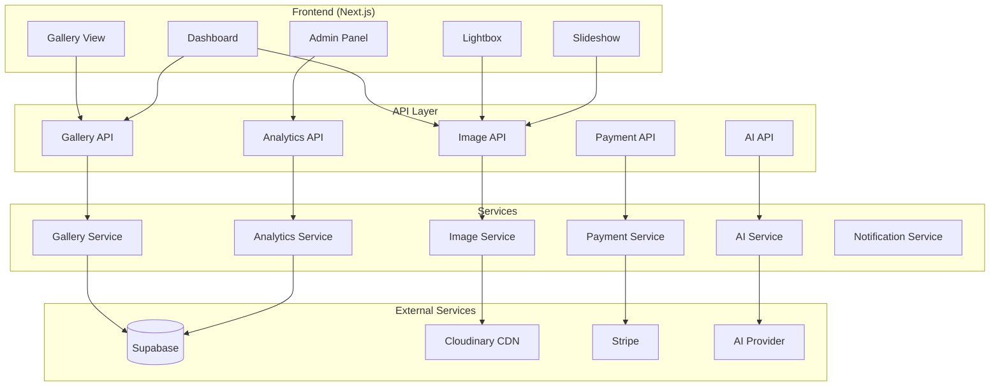

# Design Document: PikSend Complete Features

## Overview

Ce document décrit l'architecture et le design technique pour l'ensemble des fonctionnalités avancées de PikSend. Le système est construit sur Next.js 14+ avec App Router, Supabase pour la base de données et l'authentification, Cloudinary pour le stockage d'images, et Stripe pour les paiements.

L'architecture suit une approche modulaire où chaque pilier de fonctionnalités est implémenté comme un ensemble de composants, services et APIs indépendants mais interconnectés.

## Architecture



## Components and Interfaces

### 1. Gallery View Components

```typescript
// src/components/gallery-view/index.ts
export interface GalleryViewProps {
  gallery: Gallery;
  images: Image[];
  isUnlocked: boolean;
  showWatermark: boolean;
  userPlan: SubscriptionPlan;
}

// Masonry Grid - Already exists, needs enhancement
export interface MasonryGridProps {
  images: ImageWithMeta[];
  onImageClick: (index: number) => void;
  onDownload: (url: string, e: React.MouseEvent) => void;
  onFavorite?: (imageId: string) => void;
  showWatermark?: boolean;
  showFavorites?: boolean;
  favorites?: Set<string>;
}

// Lightbox - Already exists, needs enhancement
export interface LightboxProps {
  images: ImageWithMeta[];
  currentIndex: number;
  title: string;
  onClose: () => void;
  onPrev: () => void;
  onNext: () => void;
  onDownload: (url: string) => void;
  onFavorite?: (imageId: string) => void;
  onComment?: (imageId: string, comment: string) => void;
  showWatermark?: boolean;
  isFavorite?: boolean;
  comments?: Comment[];
}

// New: Slideshow Component
export interface SlideshowProps {
  images: ImageWithMeta[];
  interval: 3000 | 5000 | 10000;
  onClose: () => void;
  autoPlay?: boolean;
}

// New: Deadline Timer Component
export interface DeadlineTimerProps {
  deadline: Date;
  onExpired?: () => void;
}

// New: Lead Magnet Modal
export interface LeadMagnetModalProps {
  galleryId: string;
  onSubmit: (email: string) => void;
  onSkip?: () => void;
}
```

### 2. Dashboard Components

```typescript
// src/components/gallery-detail/index.ts

// Enhanced Settings Tab
export interface GallerySettingsProps {
  gallery: Gallery;
  userPlan: SubscriptionPlan;
  onUpdate: (settings: GallerySettings) => void;
}

export interface GallerySettings {
  title: string;
  password: string;
  expirationDays: number;
  // New fields
  enableFavorites: boolean;
  enableComments: boolean;
  enableDeadline: boolean;
  deadlineDate?: Date;
  enableLeadMagnet: boolean;
  ctaButton?: CTAButtonConfig;
  videoCoverUrl?: string;
  audioUrl?: string;
  customColors?: BrandColors;
  noindex: boolean;
}

export interface CTAButtonConfig {
  text: string;
  url: string;
  style: 'primary' | 'secondary';
}

export interface BrandColors {
  primary: string;
  secondary: string;
  accent: string;
}

// QR Code Generator
export interface QRCodeGeneratorProps {
  galleryUrl: string;
  galleryTitle: string;
  logoUrl?: string;
}
```

### 3. Service Interfaces

```typescript
// src/lib/services/types.ts

export interface FavoritesService {
  toggleFavorite(galleryId: string, imageId: string, sessionId: string): Promise<boolean>;
  getFavorites(galleryId: string, sessionId: string): Promise<string[]>;
  exportFavorites(galleryId: string): Promise<FavoriteExport>;
}

export interface CommentsService {
  addComment(imageId: string, comment: string, sessionId: string): Promise<Comment>;
  getComments(imageId: string): Promise<Comment[]>;
  deleteComment(commentId: string): Promise<void>;
}

export interface AnalyticsService {
  trackView(galleryId: string, metadata: ViewMetadata): Promise<void>;
  getGalleryStats(galleryId: string): Promise<GalleryStats>;
  trackCTAClick(galleryId: string): Promise<void>;
}

export interface AIService {
  detectFaces(imageUrl: string): Promise<FaceDetection[]>;
  matchFace(selfieUrl: string, galleryId: string): Promise<string[]>;
  generateCaption(imageUrl: string): Promise<string>;
  analyzeQuality(imageUrl: string): Promise<QualityAnalysis>;
}

export interface NotificationService {
  sendFavoritesEmail(photographerId: string, galleryId: string, favorites: string[]): Promise<void>;
  sendCommentNotification(photographerId: string, imageId: string, comment: string): Promise<void>;
  sendExpirationWarning(photographerId: string, galleryId: string, daysRemaining: number): Promise<void>;
}
```

## Data Models

### Database Schema Extensions

```sql
-- New tables for engagement features

-- Favorites table
CREATE TABLE public.favorites (
  id UUID PRIMARY KEY DEFAULT gen_random_uuid(),
  gallery_id UUID NOT NULL REFERENCES public.galleries(id) ON DELETE CASCADE,
  image_id UUID NOT NULL REFERENCES public.images(id) ON DELETE CASCADE,
  session_id VARCHAR(255) NOT NULL,
  created_at TIMESTAMP WITH TIME ZONE DEFAULT NOW(),
  UNIQUE(gallery_id, image_id, session_id)
);

-- Comments table
CREATE TABLE public.comments (
  id UUID PRIMARY KEY DEFAULT gen_random_uuid(),
  image_id UUID NOT NULL REFERENCES public.images(id) ON DELETE CASCADE,
  session_id VARCHAR(255) NOT NULL,
  content TEXT NOT NULL,
  created_at TIMESTAMP WITH TIME ZONE DEFAULT NOW()
);

-- Gallery analytics table
CREATE TABLE public.gallery_analytics (
  id UUID PRIMARY KEY DEFAULT gen_random_uuid(),
  gallery_id UUID NOT NULL REFERENCES public.galleries(id) ON DELETE CASCADE,
  visitor_ip VARCHAR(45),
  country_code VARCHAR(2),
  user_agent TEXT,
  viewed_at TIMESTAMP WITH TIME ZONE DEFAULT NOW()
);

-- Lead captures table
CREATE TABLE public.lead_captures (
  id UUID PRIMARY KEY DEFAULT gen_random_uuid(),
  gallery_id UUID NOT NULL REFERENCES public.galleries(id) ON DELETE CASCADE,
  email VARCHAR(255) NOT NULL,
  captured_at TIMESTAMP WITH TIME ZONE DEFAULT NOW(),
  UNIQUE(gallery_id, email)
);

-- Testimonials table
CREATE TABLE public.testimonials (
  id UUID PRIMARY KEY DEFAULT gen_random_uuid(),
  gallery_id UUID NOT NULL REFERENCES public.galleries(id) ON DELETE CASCADE,
  rating INTEGER NOT NULL CHECK (rating >= 1 AND rating <= 5),
  comment TEXT,
  author_name VARCHAR(255),
  is_public BOOLEAN DEFAULT false,
  created_at TIMESTAMP WITH TIME ZONE DEFAULT NOW()
);

-- Gallery settings extension
ALTER TABLE public.galleries ADD COLUMN settings JSONB DEFAULT '{}';
-- Settings JSON structure:
-- {
--   "enableFavorites": boolean,
--   "enableComments": boolean,
--   "enableDeadline": boolean,
--   "deadlineDate": timestamp,
--   "enableLeadMagnet": boolean,
--   "ctaButton": { "text": string, "url": string },
--   "videoCoverUrl": string,
--   "audioUrl": string,
--   "customColors": { "primary": string, "secondary": string, "accent": string },
--   "noindex": boolean
-- }

-- Profile branding extension
ALTER TABLE public.profiles ADD COLUMN branding JSONB DEFAULT '{}';
-- Branding JSON structure:
-- {
--   "customLogo": string,
--   "customDomain": string,
--   "brandColors": { "primary": string, "secondary": string, "accent": string },
--   "profileSlug": string,
--   "profileBio": string
-- }

-- Admin settings table
CREATE TABLE public.admin_settings (
  key VARCHAR(255) PRIMARY KEY,
  value JSONB NOT NULL,
  updated_at TIMESTAMP WITH TIME ZONE DEFAULT NOW()
);

-- Insert default admin settings
INSERT INTO public.admin_settings (key, value) VALUES
  ('stripe_enabled', 'true'),
  ('ai_features_enabled', 'true');
```

### TypeScript Types Extension

```typescript
// src/types/index.ts - Extensions

export interface ImageWithMeta extends Image {
  isFavorite?: boolean;
  comments?: Comment[];
  altText?: string;
  qualityScore?: number;
}

export interface Comment {
  id: string;
  imageId: string;
  sessionId: string;
  content: string;
  createdAt: string;
}

export interface GalleryStats {
  totalViews: number;
  uniqueVisitors: number;
  viewsByCountry: Record<string, number>;
  viewsByDate: { date: string; count: number }[];
  ctaClicks: number;
  favoritesCount: number;
  commentsCount: number;
}

export interface ViewMetadata {
  ip?: string;
  userAgent?: string;
  countryCode?: string;
}

export interface FaceDetection {
  boundingBox: { x: number; y: number; width: number; height: number };
  confidence: number;
  embedding?: number[];
}

export interface QualityAnalysis {
  isBlurry: boolean;
  hasClosedEyes: boolean;
  isDuplicate: boolean;
  duplicateOf?: string;
  overallScore: number;
}

export interface PlanFeatures {
  slideshow: boolean;
  favorites: boolean;
  comments: boolean;
  detailedAnalytics: boolean;
  ctaButton: boolean;
  customWatermark: boolean;
  bulkDownload: boolean;
  paywall: boolean;
  whiteLabel: boolean;
  customDomain: boolean;
  brandColors: boolean;
  profilePage: boolean;
  deadlineTimer: boolean;
  leadMagnet: boolean;
  videoCover: boolean;
  audioGallery: boolean;
  testimonials: boolean;
  lightroomPlugin: boolean;
  faceRecognition: boolean;
  autoCaption: boolean;
  smartCulling: boolean;
}
```

## Correctness Properties

*A property is a characteristic or behavior that should hold true across all valid executions of a system—essentially, a formal statement about what the system should do. Properties serve as the bridge between human-readable specifications and machine-verifiable correctness guarantees.*

### Property 1: Plan-Based Feature Access

*For any* user with a given subscription plan, accessing a feature SHALL return the correct availability based on the plan feature matrix.

**Validates: Requirements 1.4.6, 3.1.5, 3.2.5, 3.3.5, 3.4.5, 4.1.5, 4.2.5, 4.4.6, 5.1.5, 5.2.5, 5.3.5, 5.4.5, 7.1.5, 7.2.5, 8.1.5, 8.2.5, 8.3.5, 9.1.5, 10.1.5, 10.2.5, 10.3.5**

### Property 2: Responsive Grid Column Count

*For any* viewport width, the Masonry Grid SHALL display the correct number of columns (2 for mobile <640px, 3-5 for desktop).

**Validates: Requirements 1.1.1**

### Property 3: Image Priority Assignment

*For any* gallery with N images, the first ABOVE_FOLD_THRESHOLD images SHALL have priority=true for LCP optimization.

**Validates: Requirements 1.1.3**

### Property 4: Lightbox Keyboard Navigation

*For any* lightbox state with currentIndex, pressing ArrowRight SHALL increment index (if not at end), pressing ArrowLeft SHALL decrement (if not at start), pressing Escape SHALL close.

**Validates: Requirements 1.2.2**

### Property 5: Lightbox Index Display Format

*For any* lightbox showing image at index I of N total images, the display SHALL show "{I+1} / {N}".

**Validates: Requirements 1.2.5**

### Property 6: Theme Persistence Round-Trip

*For any* theme preference (dark/light), setting the theme and reloading SHALL restore the same theme from localStorage.

**Validates: Requirements 1.3.4**

### Property 7: Upload Retry Logic

*For any* failed upload, the system SHALL retry up to 3 times before marking as failed.

**Validates: Requirements 2.1.5**

### Property 8: Concurrent Upload Limit

*For any* batch of N uploads where N > 3, at most 3 uploads SHALL be in progress simultaneously.

**Validates: Requirements 2.1.4**

### Property 9: Sorting Stability

*For any* array of images sorted by a criterion, the result SHALL be correctly ordered according to that criterion.

**Validates: Requirements 2.3.1, 2.3.2, 2.3.3**

### Property 10: Expiration Date Calculation

*For any* gallery with expirationDays D, the expires_at date SHALL be exactly D days after created_at.

**Validates: Requirements 2.4.1**

### Property 11: Password Hash Security

*For any* password, the stored hash SHALL NOT be reversible and SHALL verify correctly with bcrypt.compare.

**Validates: Requirements 2.5.3**

### Property 12: Rate Limiting Enforcement

*For any* IP address making password attempts, after 5 failed attempts within 15 minutes, subsequent attempts SHALL be blocked.

**Validates: Requirements 2.5.4**

### Property 13: Favorites Toggle Idempotence

*For any* image, toggling favorite twice SHALL return to the original state.

**Validates: Requirements 3.1.2**

### Property 14: Watermark Visibility by Plan

*For any* gallery view, watermark SHALL be visible if plan is Free OR gallery is not unlocked.

**Validates: Requirements 4.1.1, 4.1.5**

### Property 15: ZIP Download Integrity

*For any* gallery download, the ZIP SHALL contain all original images with matching checksums.

**Validates: Requirements 4.2.3**

### Property 16: HD Quality Gating

*For any* image request, HD quality SHALL only be served if gallery.is_unlocked is true OR user has Premium/Pro plan.

**Validates: Requirements 4.3.2, 4.3.3**

### Property 17: SEO Meta Tag Generation

*For any* gallery with noindex=true, the page SHALL include `<meta name="robots" content="noindex">` and X-Robots-Tag header.

**Validates: Requirements 6.3.2, 6.3.3**

### Property 18: Language Detection and Switching

*For any* browser language preference, the system SHALL detect and apply the correct locale, and manual switching SHALL persist.

**Validates: Requirements 6.4.1, 6.4.3, 6.4.4**

### Property 19: QR Code Round-Trip

*For any* gallery URL, generating a QR code and decoding it SHALL return the original URL.

**Validates: Requirements 7.3.1, 7.3.2**

### Property 20: Deadline Timer Calculation

*For any* deadline date, the countdown SHALL correctly calculate remaining days/hours/minutes.

**Validates: Requirements 7.1.2**

### Property 21: Stripe Toggle Effect

*For any* admin toggle of Stripe enabled/disabled, paywall features SHALL immediately reflect the new state.

**Validates: Requirements A.1.2, A.1.5**

## Error Handling

### API Error Responses

```typescript
// Standardized error response format
interface ApiError {
  error: string;
  code: ErrorCode;
  details?: Record<string, unknown>;
}

type ErrorCode =
  | 'UNAUTHORIZED'
  | 'FORBIDDEN'
  | 'NOT_FOUND'
  | 'RATE_LIMITED'
  | 'VALIDATION_ERROR'
  | 'PAYMENT_REQUIRED'
  | 'FEATURE_DISABLED'
  | 'PLAN_LIMIT_EXCEEDED'
  | 'INTERNAL_ERROR';

// Feature access error
function checkFeatureAccess(feature: keyof PlanFeatures, userPlan: SubscriptionPlan): void {
  const features = getPlanFeatures(userPlan);
  if (!features[feature]) {
    throw new ApiError('Feature not available for your plan', 'FORBIDDEN', {
      feature,
      requiredPlan: getRequiredPlan(feature)
    });
  }
}

// Stripe disabled error
function checkStripeEnabled(): void {
  const settings = getAdminSettings();
  if (!settings.stripe_enabled) {
    throw new ApiError('Payments are temporarily unavailable', 'FEATURE_DISABLED');
  }
}
```

### Client-Side Error Handling

```typescript
// Error boundary for gallery view
function GalleryErrorBoundary({ error }: { error: Error }) {
  if (error.code === 'FORBIDDEN') {
    return <UpgradePrompt feature={error.details?.feature} />;
  }
  if (error.code === 'FEATURE_DISABLED') {
    return <FeatureDisabledMessage message={error.message} />;
  }
  return <GenericError />;
}
```

## Testing Strategy

### Unit Tests

Unit tests focus on specific examples and edge cases:

- Plan feature matrix validation
- Date/time calculations (expiration, countdown)
- Password hashing and verification
- Input validation (email, URLs)
- Color parsing and validation
- QR code generation

### Property-Based Tests

Property-based tests verify universal properties across all inputs using fast-check:

```typescript
// Example: Plan feature access property test
import fc from 'fast-check';

describe('Plan Feature Access', () => {
  it('should correctly determine feature availability for any plan', () => {
    fc.assert(
      fc.property(
        fc.constantFrom('free', 'premium', 'pro'),
        fc.constantFrom(...Object.keys(PLAN_FEATURES)),
        (plan, feature) => {
          const result = hasFeatureAccess(plan, feature);
          const expected = PLAN_FEATURES[plan][feature];
          return result === expected;
        }
      ),
      { numRuns: 100 }
    );
  });
});
```

### Integration Tests

- API endpoint testing with Supabase
- Stripe webhook handling
- Cloudinary upload/transform
- Email notification delivery

### E2E Tests

- Gallery creation and sharing flow
- Payment and unlock flow
- Favorites and comments flow
- Theme switching persistence
